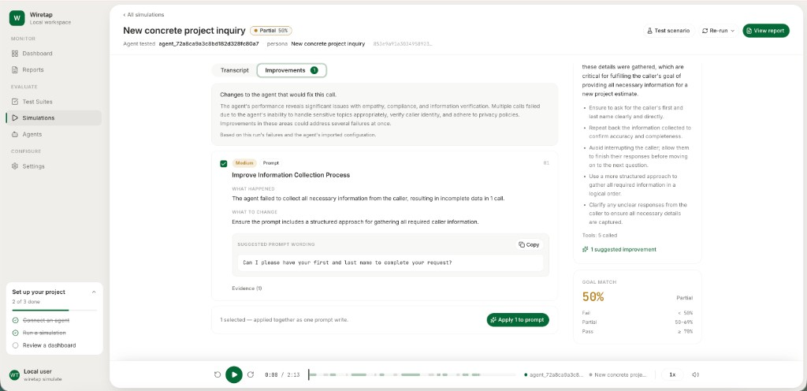

# Wiretap

[](LICENSE)
[](https://www.python.org/downloads/)
[](#how-wiretap-compares)
[](LICENSE)
[](https://github.com/mohibsaas/wiretap/commits/main)
[](https://www.python.org/)
[](#setup-for-non-technical-users)
[](#quick-setup-for-developers)
[](#what-it-is)
[](#data-layout)
[](#platforms)
[](docs/HLD.md)
[](https://github.com/mohibsaas/wiretap/stargazers)
[](https://github.com/mohibsaas/wiretap/issues)
[](https://github.com/mohibsaas/wiretap/commits/main)
[](https://github.com/mohibsaas/wiretap/graphs/contributors)
[](https://github.com/mohibsaas/wiretap/graphs/commit-activity)
[](https://github.com/mohibsaas/wiretap)
[](https://wiretap-website.vercel.app/)
[](https://youtu.be/-lqZwtQXGls)

**Website:** [wiretap-website.vercel.app](https://wiretap-website.vercel.app/)

[](https://youtu.be/-lqZwtQXGls)

You built an AI that talks to customers. You called it a few times. It seemed fine. That is not a real test.
Wiretap is a CLI-first, local-first voice agent test simulator. It does not rebuild or run your agent locally. Instead, it dials your live deployed voice agent (Retell, Vapi, ElevenLabs, LiveKit, Synthflow, or any phone number via Twilio PSTN) with its own LLM-driven test caller — not a copy of your agent, the real thing.

Each run throws 50+ real-life customer conversations at it: angry callers, confused callers, callers trying to talk their way into a refund they shouldn't get. Wiretap checks whether your agent's tool calls actually fire, saves the full transcript and audio for every call, and scores each one with deterministic rules plus an LLM judge.

You get a report card, not just a pass/fail — scores broken down by category, so you know exactly what to fix and where. A public leaderboard and quality badges are on the way, so you'll be able to publish your score and show it off.

> **Note:** Once the leaderboard is live, submitting a 50+ test run at [wiretap-website.vercel.app](https://wiretap-website.vercel.app/) ranks your agent on the board and earns you $10 in free PyAI API credits per submission.

**New here?** Jump to [setup for non-technical users](#setup-for-non-technical-users) if you've never used a terminal, or [quick setup for developers](#quick-setup-for-developers) if you have.

**Problem:** Teams shipping voice agents have no practical way to regression-test real voice behavior — latency, STT/TTS, turn-taking, tool calls, emotional callers — before production.

**Solution:** Wiretap acts as an automated QA caller + evaluator. Import your agent config → generate scenarios → run live calls → read the report card and ship the fix.

Paid tools charge hundreds a month for this. Hamming is about $500/mo. This is a git clone.

```text
   ┌─────────────┐         dial          ┌──────────────────┐
   │   WIRETAP   │ ───────────────────▶  │ Your live agent  │
   │  test agent │   web / phone / text  │  (Retell, Vapi…) │
   │  + judge    │ ◀───────────────────  │                  │
   └─────────────┘         reply         └──────────────────┘
```

---

**Contents:** [What it is](#what-it-is) · [Why use it](#why-use-it) · [Why choose wiretap](#why-choose-wiretap) · [What it's not](#what-its-not) · [What wiretap can do](#what-wiretap-can-do) · [Who it's for](#who-its-for) · [How wiretap compares](#how-wiretap-compares) · [Setup for non-technical users](#setup-for-non-technical-users) · [Quick setup for developers](#quick-setup-for-developers) · [Commands](#commands) · [Platforms](#platforms) · [How scoring works](#how-scoring-works) · [Contributing](#contributing)

---


## What it is

A **voice agent** is an AI that talks on a call. Booking, support, sales — same idea.

**Wiretap is a test harness.** It pretends to be the caller. It talks to your *live* agent — the one customers would actually reach — not a local replica. Then it tells you if the agent held up.

It runs on your computer. From the terminal, or a local UI. Nothing phones home.

---


## Why use it

Calling your own agent a few times is not testing. Your agent has likely never faced:

- An angry customer about a bad charge
- Someone with a heavy accent speaking fast
- A caller who interrupts every two seconds
- Someone trying to jailbreak a refund
- A long call that jumps topics

Wiretap generates those kinds of tests, runs them against the live agent, and scores the result. You can do it once, or every time you ship.

**If you run the business:**

- 32% of customers say they'll walk away from a brand they love after just one bad experience ([PwC, *Experience is everything*, 2018](https://www.pwc.de/de/consulting/pwc-consumer-intelligence-series-customer-experience.pdf)). A confused or rude AI phone call is exactly that experience, and most owners never hear it happen.
- Testing it yourself covers a handful of calls in one sitting. One `wiretap simulate` run covers 50+ different customer situations, unattended, while you do something else.
- A paid testing platform runs $100–$500+/month before you've tested a single call. Wiretap costs $0 — you only pay a few cents per call for the AI you're already using.

**If you're the developer:**

- 100 test calls at ~3 minutes each cost about $75 on a per-minute platform like Cekura ($0.25/voice-min). The same 100 calls cost $0 in wiretap harness fees — only your own LLM/STT/TTS usage.
- The judge is pinned at `temperature=0.0`, so a regression you ship shows up as a score drop, not judge noise from one run to the next.
- Every category — `emotional`, `linguistic`, `adversarial`, `operational`, `factual`, `compliance`, `task`, `other` — gets its own score, so a regression in one area doesn't hide inside an overall "pass."
- `wiretap simulate --all` runs the whole suite in one command, in CI or locally — no manual click-through before every deploy.

---


## Why choose wiretap

The category is full of paid platforms and open-source tools that don't quite test the real thing.


|                                | Paid tools (Hamming, Cekura, Coval) | Other open source                                     | Wiretap                                 |
| ------------------------------ | ----------------------------------- | ----------------------------------------------------- | --------------------------------------- |
| Price                          | $100–$500+/mo, or per minute        | Free                                                  | **$0** — you only pay your own API keys |
| Tests your live agent          | Yes                                 | Often no — replica, or can't reach the deployed agent | **Yes — default**                       |
| Open source                    | No                                  | Yes                                                   | **Yes (MIT)**                           |
| You can read the scoring logic | No                                  | Rarely disclosed                                      | **Yes — in this repo**                  |
| Runs on your machine           | No (SaaS)                           | Often yes                                             | **Yes — local-first**                   |
| Terminal + CI                  | Usually web or a sales call         | Mixed                                                 | **Yes**                                 |


Hamming, Cekura, and Coval dial live agents too. They also bill you, hide the eval logic, and want a vendor relationship.

VoiceTest tests a local reconstruction by default. ServiceNow/eva is strong research software, but it cannot reach a deployed agent.

Wiretap's job is narrower: **test the agent you actually deployed, for free, with scoring you can read.**

If you need production monitoring, auditor-facing reports, or a hosted dashboard, use a paid platform. If you need to test your live agent from your laptop, use wiretap. (Full vendor-by-vendor breakdown: [How wiretap compares](#how-wiretap-compares).)

You don't just get a pass/fail. You get the score, the reason, and wording you can apply to the agent.




---


## What it's not

- Not a voice-agent builder. It tests agents. It does not create them.
- Not production monitoring. No live ops dashboard.
- Not a hosted SaaS. Results stay in `~/.wiretap/` on your machine.
- Not magic. Voice testing is not fully deterministic. The judge is pinned at temperature `0.0` so scores don't drift on a whim — and that config is in the repo.

---


## What wiretap can do

Plain-language rundown of what's actually inside, and how each piece works.

- **Calls your real agent, not a copy.** Wiretap dials the same agent your customers reach — on Vapi, Retell, ElevenLabs Agents, LiveKit Agents, or Synthflow, directly over WebSocket or LiveKit. Bland and Bolna agents can be imported and reached by calling their real phone number over PSTN (with your own Twilio account) instead.

- **Writes the test callers for you.** Point wiretap at your agent and it generates a batch of test scenarios, sorted into eight kinds of caller:
  - `emotional` — angry, anxious, or grieving callers. Does your agent stay calm and still get things done?
  - `linguistic` — heavy accents, fast speech, ASR mishearings. Does it clarify without being rude?
  - `adversarial` — jailbreak attempts, social engineering, fake authority ("I'm from IT"). Does it hold the line?
  - `operational`, `factual`, `compliance`, `task`, `other` — the day-to-day stuff: correct answers, following policy, actually finishing the job.

- **Scores every call two ways.**
  - **Rules** — plain, no-AI checks: phrases the agent must say, must never say, or patterns it must match. Either it matches or it doesn't.
  - **Judge** — an AI reads the full transcript and grades whether the caller actually got what they needed: pass, partial, or fail. It's locked to its most literal setting (`temperature=0.0`), so it doesn't get more or less generous from one run to the next. The code for it is public, right here in the repo (`src/wiretap/eval/judge.py`).

- **Checks whether your agent's actions actually fire.** If your agent says it booked an appointment or looked up an order, wiretap checks the underlying tool call — not just whether it sounded confident saying so.

- **Tells you what to change, not just what broke.** After a call that didn't go well, wiretap suggests a specific fix — often the exact new sentence to add to your agent's prompt — that you can copy straight in. See it in action in the screenshot above.

- **Scripts range from loose to strict.** Give a scenario just a persona and a goal, pin one exact line it has to hit partway through, or lay out a full multi-step conversation. Use whichever fits how tightly you need to test.

- **Everything stays on your computer.** No account, no cloud dashboard. Transcripts, recordings, and scores all land in a `~/.wiretap` folder on your machine.

- **A visual dashboard, if you want one.** `wiretap ui run` opens a local website where you can watch a test run live, play back the audio, and read the transcript next to the score.

- **Plugs into your coding tools.** An optional MCP server lets AI coding assistants (like Cursor or Claude Code) trigger and read wiretap tests directly.

- **Free.** You only pay for the AI you already use — your own LLM and speech (STT/TTS) API keys. There's no wiretap subscription, seat, or per-minute charge.

---


## Who it's for

Wiretap doesn't ship a canned test pack per industry. Instead, `wiretap suite generate --purpose "..."` describes what your agent actually does, and wiretap builds category-based scenarios around that. Here's what that looks like for a few kinds of businesses:

- **Home services** (plumbing, HVAC, electricians, locksmiths)
  - An emergency caller who wants dispatch now, not a callback window
  - A customer disputing a quote or a surprise trip fee
  - A caller asking the agent to promise a specific arrival time it can't guarantee

- **Healthcare & dental practices**
  - An anxious patient calling about symptoms or test results
  - Someone asking for another patient's information over the phone
  - A caller pushing for a same-day appointment the schedule can't support

- **Real estate**
  - A lead asking to book a showing outside normal hours
  - A caller fishing for the seller's bottom-line price
  - Someone with partial, garbled information about a listing address

- **Restaurants & hospitality**
  - A large-party reservation the agent has to sanity-check against capacity
  - A caller complaining about a past visit and wanting compensation
  - Someone with dietary restrictions who needs accurate, not invented, answers

- **E-commerce & retail**
  - A caller disputing a charge or demanding an instant refund
  - Someone asking for order status the agent doesn't actually have access to
  - A return request just outside the stated policy window

- **Financial services & insurance**
  - A caller asking for account details without passing identity verification
  - Someone filing a claim who needs to be walked through required disclosures
  - A caller pressuring the agent to waive a fee or bend a stated policy

- **Legal services**
  - An intake call with confidential details the agent must handle carefully
  - A caller asking for legal advice the agent isn't allowed to give
  - Someone demanding a callback time the firm can't commit to

- **Automotive (dealerships & repair shops)**
  - A caller asking for a repair cost estimate over the phone
  - Someone upset about a delayed part or missed pickup time
  - A caller trying to book a service slot that's already full

Whatever your industry, the same eight categories apply: `emotional`, `linguistic`, `adversarial`, `operational`, `factual`, `compliance`, `task`, `other`. The scenarios above are what those categories look like once they're grounded in a real business.

---


## How wiretap compares

The short version: paid platforms will dial your live agent too, but they charge for it and hide how scoring works. Other open-source tools are free, but they either can't reach your actual deployed agent or they test a stand-in for it instead. Wiretap is free, dials the real thing, and shows you exactly how it grades every call.

None of this claims wiretap is "deterministic" — no tool in this space is, because the agent under test, the speech models, and the network are all a little unpredictable by nature. The one thing wiretap does that nobody else discloses: its judge is pinned at `temperature=0.0`, in the open, in this repo.

### vs. paid platforms

| Platform | Starting price | Dials your live agent | Open source | You can read the scoring code | Runs on your machine |
| --- | --- | --- | --- | --- | --- |
| **Wiretap** | **$0 forever** — you only pay your own API keys | **Yes — the default path** | **Yes (MIT), the entire product** | **Yes — it's this repo** | **Yes — local-first** |
| Hamming | Unpublished, sales call required (~$500+/mo) | Yes | No | No | No — SaaS only |
| Cekura | $0 trial credits, then $0.25/voice-minute | Yes | No | No | No — SaaS only |
| Coval | $100/mo minimum | Yes | No (only its benchmark runner is open) | No | No — SaaS only |
| Roark | $0 trial credit, then $0.15/min | Yes | No | No | No — SaaS only |
| Maxim AI | Free tier excludes voice; $29–49/seat/mo unlocks it | Voice is a bolt-on to a general LLM eval tool | No (only an unrelated gateway is open) | No | No — SaaS only |

If you need a hosted dashboard, a compliance-auditor-facing report, or a bigger library of named metrics today, those platforms are more built out for that. If you want to test your live agent for free with logic you can actually read, that's wiretap's job.

### vs. other open-source tools

| Project | Can it call your already-deployed agent? | Actively maintained | Local dashboard |
| --- | --- | --- | --- |
| **Wiretap** | **Yes — real live voice calls by default** (Vapi WebSocket, Retell LiveKit) | **Yes — active** | **Yes** |
| ServiceNow/eva | No — cannot reach a deployed agent yet (tracked in open GitHub issues #35, #126, #181) | Yes | No |
| VoiceTest | Only partly — by default it tests a local reconstruction of your agent, not the live one | Mostly | Yes (DuckDB-based) |
| voice-lab | No — text-only, no live dial | No — dormant since May 2025 | No |

ServiceNow/eva is well-built research software with real academic rigor in how it scores audio — it's a fair reference for evaluation quality. It just can't dial the agent you actually shipped. Wiretap can.

### Where wiretap honestly falls short today

- No production monitoring or live-ops dashboard — it's a testing tool, not observability.
- One judge, no multi-judge panel, and no audio-native tone scoring (things like Roark and Hamming offer).
- Bland and Bolna have no direct WebSocket/LiveKit integration — wiretap imports their agent config and reaches them by dialing the real phone number over PSTN instead (needs the Twilio `pstn` extra).

Say this part loudly, not quietly. If any of these are what you need right now, a paid platform is the better fit today.

---


## Setup for non-technical users

This section is for anyone who has never opened a terminal — a shop owner, a solo founder, or anyone whose AI phone agent was set up by someone else (an agency, a freelancer, a "no-code" tool) and who just wants to know: **does it actually work?**

If you're comfortable with a terminal already, skip to [Quick setup for developers](#quick-setup-for-developers).

### What you're about to do, in one sentence

You'll install one small free program on your computer. It will call your own AI phone agent, pretend to be a difficult customer a few dozen times, and tell you — in plain pass/partial/fail terms — where it did well and where it needs fixing.

### Before you start — a checklist

- **A Mac or Windows computer** you're allowed to install software on (not a locked-down work laptop).
- **Your AI agent already exists somewhere** — Vapi, Retell, ElevenLabs, LiveKit, or Synthflow are the ones wiretap can call directly today. Whoever built your agent (you, a freelancer, or an agency) can tell you which one it's on.
- **An "API key" for that platform.** Think of it as a long password that lets wiretap and your AI agent's platform talk to each other. It lives in that platform's website, usually under a "Settings," "API," or "Developers" menu. If you didn't build the agent yourself, ask whoever did for this key — it's safe to share with tools you run yourself (never paste it into a website you don't control).
- **An API key for an AI provider** to power the test caller and the judge — OpenAI is the simplest place to start. You'll likely need to add a small amount of billing credit there (a few dollars covers a lot of test calls).
- **About 30 minutes**, uninterrupted, the first time.

### Step 1 — Open the Terminal

The Terminal is just a plain window where you type instructions instead of clicking buttons. It looks intimidating. It isn't — you're going to copy and paste every single thing.

- **On a Mac:** press `Cmd + Space`, type `Terminal`, and press `Enter`.
- **On Windows:** click the Start menu, type `PowerShell`, and press `Enter`. (Most commands below work the same way. If one doesn't, installing [WSL](https://learn.microsoft.com/windows/wsl/install) gives you a Mac-like terminal on Windows.)

A window with text will open. That's it — that's the Terminal.

### Step 2 — Install the tools wiretap needs

Wiretap needs three things installed first: `git` (downloads code from GitHub), `Python` (the language wiretap is written in), and `uv` (a tool that installs wiretap and its dependencies for you). If you're not sure whether you already have them, it's safe to run these anyway.

**On a Mac**, paste this one line, press Enter, and follow any on-screen prompts (it may ask for your Mac password — that's normal):

```bash
xcode-select --install
```

Then install `uv` (this also gives you a working Python if you don't have one):

```bash
curl -LsSf https://astral.sh/uv/install.sh | sh
```

**On Windows (PowerShell)**, install `uv` with:

```powershell
powershell -ExecutionPolicy ByPass -c "irm https://astral.sh/uv/install.ps1 | iex"
```

After either install finishes, **close the Terminal window and open a new one** so the new tools are recognized.

### Step 3 — Download wiretap

This copies the wiretap project onto your computer, into a new folder called `wiretap`. Paste these lines one at a time (or all together — pasting a whole block is fine):

```bash
git clone https://github.com/mohibsaas/wiretap.git
cd wiretap
uv sync
uv tool install --editable .
```

Nothing dangerous happens here — this just downloads a folder of code and prepares it to run. It won't touch your AI agent yet.

### Step 4 — Get your API keys ready

Open two browser tabs:

1. Your AI agent's platform (Vapi, Retell, ElevenLabs, LiveKit, or Synthflow) → find the **API key** in its settings/developer page. Copy it somewhere temporarily, like a notes app.
2. [platform.openai.com](https://platform.openai.com) (or whichever LLM/speech provider you prefer) → create an API key there too.

You'll paste these into wiretap in the next step. They're never uploaded anywhere — they're saved only in a file on your own computer.

### Step 5 — Run the setup wizard

This is the main step. It asks you a series of plain-English questions and quietly saves your answers.

```bash
wiretap init                 # test agent → live agent → suite → optional phone
```

Here's what to expect, in order:

1. **"Configure your test agent"** — this is the AI that will pretend to be the caller. Paste in your LLM API key (e.g. OpenAI) when asked.
2. **"Connect your live agent"** — pick your platform (Vapi, Retell, etc.) and paste in that platform's API key, then the ID of the specific agent to test (this is usually visible on that platform's dashboard next to your agent's name).
3. **"Generate a test suite"** — wiretap writes a batch of test scenarios for you automatically. You don't need to write anything.
4. **"Optional phone setup"** — skip this unless you specifically want to test over a real phone number (that needs a Twilio account too — see [Platforms](#platforms)).

If you ever want to double-check what's configured without exposing your keys, run:

```bash
wiretap status
```

### Step 6 — Run your first test

This is the part where wiretap actually calls your agent. Replace `<suite>` with the suite name wiretap showed you at the end of `wiretap init` (it'll be something like `retell_agent_xxx`):

```bash
wiretap simulate -s <suite> --all
wiretap report
```

You'll see wiretap dial your agent, play out a conversation as a test caller, hang up, and repeat for each scenario. `wiretap report` then prints a plain summary: how many calls passed, partially passed, or failed.

### Step 7 — See it visually (optional, but worth it)

If you'd rather read results on a webpage than in the Terminal, install and open the local dashboard:

```bash
cd ui && npm install && npm run build && cd ..
wiretap ui run
# → http://127.0.0.1:8787
```

This opens in your regular web browser, on your own computer — nothing is hosted online. You'll see each call, its score, and — for the ones that didn't fully pass — a specific suggestion for what to change, like the example below.


### If something goes wrong

- **A command says "command not found."** Close the Terminal and open a fresh one — this usually means a tool installed in Step 2 hasn't been picked up yet.
- **`wiretap init` says it needs an interactive terminal.** Make sure you're running it directly in the Terminal window, not through a script or automation.
- **You don't have an agent yet, or aren't sure which platform it's on.** Ask whoever built it. Wiretap needs to know the platform (Vapi, Retell, etc.) and the agent's ID.
- **Still stuck?** Every command above is safe to show a technical friend or a developer — none of it deletes anything or touches your live agent's configuration.

---


## Quick setup for developers

**You need:** Python ≥3.11, [uv](https://docs.astral.sh/uv/), and API keys for an LLM plus speech (STT/TTS — speech-to-text and text-to-speech). A platform key (e.g. Retell / Vapi) is needed to dial a live agent.

```bash
git clone https://github.com/mohibsaas/wiretap.git
cd wiretap
uv sync
uv tool install --editable .

wiretap init                 # test agent → live agent → suite → optional phone
wiretap simulate -s <suite> --all
wiretap report
```

`wiretap init` writes secrets to `~/.wiretap/.env` only (never into suite YAML). Check config without leaking keys:

```bash
wiretap status
```

> **Tip:** Prefer `uv tool install --editable .` so `wiretap` is on your PATH. `uv run wiretap …` works without installing.


### Minimal path (already have keys)

```bash
# Put keys in ~/.wiretap/.env — see .env.example
wiretap import retell --agent-id agent_xxx
wiretap simulate --suite retell_agent_xxx --all
wiretap report
```

---


## Local UI

A browser dashboard on your machine. Same `~/.wiretap/` data and onboarding as the CLI.

```bash
cd ui && npm install && npm run build && cd ..
wiretap ui run
# → http://127.0.0.1:8787
```

For UI development (hot reload):

```bash
uv run wiretap ui run --no-open          # API on :8787
cd ui && npm install && npm run dev      # Vite proxies /api
```

---


## Optional extras

```bash
uv sync --extra pstn   # real phone calls via Twilio
uv sync --extra mcp    # MCP server for coding agents
uv sync --extra dev    # pytest + ruff
```

**Phone:** web vs phone is a per-run choice (`--transport phone`). Needs Twilio credentials from `wiretap init` (or `.env`).

**MCP:**

```bash
uv sync --extra mcp
uv run wiretap-mcp
```

Cursor example (`.cursor/mcp.json`):

```json
{
  "mcpServers": {
    "wiretap": { "command": "uv", "args": ["run", "wiretap-mcp"] }
  }
}
```

---


## Commands


| Command            | What it does                                            |
| ------------------ | ------------------------------------------------------- |
| `wiretap init`     | First-run setup (simulator → agent → suite → phone)     |
| `wiretap import …` | Pull a platform agent + generate category tests         |
| `wiretap suite …`  | list / show / categories / generate                     |
| `wiretap simulate` | Dial (`--all` or `--scenario`, `--transport web|phone`) |
| `wiretap report`   | Summarize local simulation artifacts                    |
| `wiretap export`   | Copy a suite out for git or sharing                     |
| `wiretap ui run`   | Local dashboard                                         |
| `wiretap status`   | What’s configured (no secret values)                    |


---


## Platforms


| Platform          | Live dial    | Notes                                    |
| ----------------- | ------------ | ---------------------------------------- |
| Vapi              | WebSocket    | `VAPI_API_KEY`                           |
| Retell            | LiveKit      | `RETELL_API_KEY`                         |
| ElevenLabs Agents | ConvAI WS    | `ELEVENLABS_API_KEY`                     |
| LiveKit Agents    | LiveKit room | `LIVEKIT_API_KEY` + `LIVEKIT_API_SECRET` |
| Synthflow         | WS media     | `SYNTHFLOW_API_KEY` + from/to numbers    |
| Bland / Bolna     | Import only  | Dial via `--transport phone`             |
| Custom / stub     | Text         | `platform: null`, `transport: text`      |
| Phone / PSTN      | Twilio SIP   | `uv sync --extra pstn`                   |


Secrets belong in `~/.wiretap/.env` or the environment. Suite YAML stores agent ids and `token_env` **names**, never key values. See [`.env.example`](.env.example).

---


## How scoring works

- **Rules** check hard constraints from the suite.
- **LLM judge** scores goal match (pass / partial / fail).
- **Suggestions** appear on failures only.
- Optional **advisor** can suggest config fixes after failing calls.

Test categories used for generation: `emotional`, `linguistic`, `adversarial`, `operational`, `factual`, `compliance`, `task`, `other`.

Your agent can *say* it booked an appointment. Wiretap can also check whether the tool call actually fired.

---


## Data layout

```text
~/.wiretap/          # or $WIRETAP_HOME
  .env               # secrets (from wiretap init)
  suites/            # YAML suites
  simulations/       # call artifacts + transcripts
  evaluations/       # run summaries + live progress
  onboard.json
```

Architecture notes: [docs/HLD.md](docs/HLD.md).

Default speech (STT/TTS) is PyAI. You can use other providers. You pay those APIs yourself — there is no wiretap bill.

---


## Contributing

See [CONTRIBUTING.md](CONTRIBUTING.md) and the [Code of Conduct](CODE_OF_CONDUCT.md).

Security reports: [SECURITY.md](SECURITY.md) — please use private disclosure, not public issues.

```bash
uv sync --extra dev
uv run ruff check src tests
uv run pytest -q
```


## License

[MIT](LICENSE)