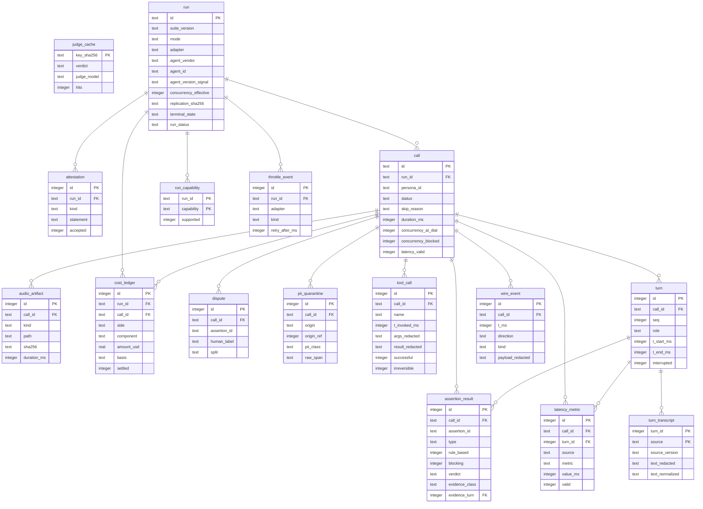

# Wiretap — Engineering Architecture

**Status:** draft 1 · **Date:** 2026-08-10 · **Build window:** Aug 13–14 2026

Every vendor fact in this document was verified against a live API on 2026-08-10
unless explicitly marked `[UNVERIFIED]`. Where it contradicts the PRD, the PRD is
wrong and the contradiction is flagged inline.

---

## 1. Provenance of the facts in this doc

| Symbol | Meaning |
|---|---|
| ✅ | Verified by a live API call on 2026-08-10 |
| 📄 | Read from vendor docs/spec, not exercised |
| ❌ | Tested and found false |
| ⬜ | Unknown, needs a probe |

Nothing below marked ✅ came from memory or from a vendor's marketing page.

---

## 2. System overview

```
┌──────────────────────────────────────────────────────────────┐
│ CLI (wiretap)        Local UI (wiretap serve)        MCP     │  thin clients
├──────────────────────────────────────────────────────────────┤
│                      SDK / harness core                      │
│ RunEngine · SuiteLoader · PersonaResolver · CallerDriver     │
│ AdapterRegistry · Transcribers · JudgeRunner · Scorer        │
│ BudgetGovernor · RateGovernor · ArtifactStore                │
├──────────────────────────────────────────────────────────────┤
│ Adapters           Caller sources          Transcribers      │
│ vapi  retell       replay-wav (default)    whisper-pinned    │
│ pyai  local-demo   pyai-omni (live)        pyai-hear         │
└──────────────────────────────────────────────────────────────┘
```

**Layering rule.** CLI, UI and MCP import only the SDK's public surface and all
three call the same `RunEngine.run(config)`. A feature that cannot be driven from
the SDK does not exist.

**Process model.** One local Python process. asyncio event loop, SQLite + files
under `./data`. No Docker, no server, no account. `wiretap serve` is the same
process serving static assets and an SSE stream.

---

## 3. Verified vendor capability matrix

| Capability | Vapi | Retell | PyAI Omni |
|---|---|---|---|
| Transport | ✅ plain WebSocket | 📄 LiveKit WebRTC (raw WS deprecated) | ✅ WebSocket |
| WS auth | ✅ **none — bare URL** | 📄 LiveKit token, 30 s window | ✅ subprotocol `pyai-key.<KEY>` |
| Uplink framing | ✅ raw PCM16, **no tag** | 📄 LiveKit track | ✅ **`0x01` tag mandatory** |
| Downlink framing | ✅ raw PCM16 | 📄 LiveKit track | ✅ `0x01`/`0x02`/`0x03` tagged |
| Downlink isolation | ✅ **agent-only** | 📄 `recording_multi_channel_url` | ✅ agent-only |
| Sample rate in / out | ✅ 16k / 16k | 📄 — | ✅ **16k in / 24k out** (asymmetric) |
| Concurrency ceiling | 📄 10 (+$10/line/mo) | 📄 20 (+$8/mo) | ✅ **8** (declares 10) |
| Overflow behaviour | 📄 silent queue | 📄 reject | ✅ HTTP 429 pre-upgrade |
| Control-plane rate limit | ✅ **~200/burst, no headers, ~21 s lockout** | ✅ **100/10 s `/get-agent`, 30/10 s `/list-agents`, full headers** | ✅ 20 rps / 40 burst declared; ~6–7 WS dials/s observed |
| Tool-call trace | ⬜ event types exist, none observed | ✅ `transcript_with_tool_calls` + `time_sec` | ❌ none |
| Transcript on wire | ✅ role-tagged partial/final | 📄 — | ❌ **bare text deltas, no role, not JSON** |
| Latency breakdown | ✅ model/voice/transcriber/endpointing/transport | ✅ `latency` object | ❌ none |
| Cost API | ✅ full component breakdown | 📄 `call_cost.combined_cost` | ❌ none — derive |
| Version pin | ✅ `latestVersion` + `/versions` | ✅ immutable int `version` | ❌ stateless |
| Prompt separable from config | ❌ **same response** | ✅ separate endpoints | n/a |
| Barge-in event | ✅ `user-interrupted` | 📄 `interruption_sensitivity` cfg | 📄 `barge_in`/`flush` |
| RAG retrieval trace | ❌ | ✅ `knowledge_base_retrieved_contents_url` | ⬜ |
| DTMF without SIP | ⬜ | ✅ `allow_user_dtmf` | ✅ `{"type":"dtmf"}` frame |
| ToS on benchmarking | 📄 silent | 📄 **prohibits without consent** | first-party |

### 3.1 Corrections to the PRD

| PRD claim | Reality |
|---|---|
| §21.1 PyAI ceiling unknown | ✅ **8** enforced, 10 declared |
| §8.3 retry on WS close `4429` | ✅ concurrency rejects arrive as **HTTP 429 pre-upgrade** — no close code, that branch never fires |
| §5.2 Omni seed/temperature "honored once supported" | ❌ absent from the configure frame entirely; `model_tier` is the no-op field |
| §17.7 resampling open | ✅ **still required** — `rate` sets input only, downlink is always 24 kHz |
| §4.5 transcripts carry role + finality | ❌ bare text deltas, no role, no timestamp, not JSON |
| §4.5 "no mid-call resume" | ❌ `resume_token` + `resume_ttl_ms: 30000` on every session |
| §2.2/§6.4 DTMF needs SIP | ❌ two of three vendors support DTMF over WS |
| §5.5 "Vapi exposes no version pin" | ❌ `latestVersion` + working `/versions` endpoint |
| §2.2 "we never see your prompt" | ❌ impossible on Vapi — prompt ships in the same GET as config and version |
| §7.1 PyAI can't do vendor transcript | partly — `/transcript` and `/recording` exist, but only inbound speech is transcribed |
| §1 "no OSS tool does duplex audio" | ❌ **LangWatch Scenario (950★) does** |
| §1 "$2–5K/mo category" | ❌ Coval Starter $100/mo, Cekura PAYG $0 |
| §14.4 Speak determinism | ❌ non-deterministic across cache misses; apparent determinism is a response cache |

---

## 4. Audio pipeline

### 4.1 Canonical format

**PCM16 LE mono @ 16 kHz** everywhere inside the harness. 20 ms frames =
320 samples = 640 bytes.

### 4.2 Per-adapter conversion

```
REPLAY caller → Vapi:    cached WAV(16k) → raw 640B frames                  no tag, no resample
REPLAY caller → PyAI:    cached WAV(16k) → 0x01 + 640B frames               tag, no resample
Vapi   → harness:        raw 640B frames                                    no tag, no resample
PyAI   → harness:        0x01 + 24k frames → strip tag → resample 24k→16k   tag + resample
```

Framing is **asymmetric between vendors**. Sharing frame-construction code
between the Vapi and PyAI adapters will produce a silent failure: PyAI drops
untagged frames with no error, no log, no counter (verified ✅).

### 4.3 Pacing

20 ms wall-clock paced, silence re-anchored not burst:

```python
next_send = max(next_send + 0.020, time.monotonic())
```

Bursting silence denies the agent's VAD the real end-of-turn gap.

### 4.4 Turn detection

RMS threshold on inbound PCM over 20 ms windows. Onset when RMS > threshold;
offset after 250 ms below. This is the **only CPU work permitted on the event
loop** — everything else (resampling, transcription, PII scanning, hashing)
runs post-call or in a thread pool, or the 20 ms clock jitters.

### 4.5 No diarization, ever

REPLAY caller audio is known by construction. Agent audio is agent-only
(verified ✅ on Vapi with a silent control run). Turn boundaries come from the
harness event log, never from speaker attribution.

**Probe method note:** a single tone probe is insufficient to prove echo — the
first Vapi run gave a false MIXED reading because the tone window landed on a
loud syllable of the greeting. A silent control run is mandatory.

### 4.6 WAV handling

PyAI Speak returns WAV with `0xFFFFFFFF` in both the RIFF and `data` size fields
(streaming placeholder), and an inconsistent `LIST` chunk. Verified ✅:

- **Never trust the WAV header for duration.** 3.36 s of audio reports 134,217 s.
- **Never assume `data` follows `fmt `.** Walk the chunks.
- Compute duration from byte count: `bytes / 2 / rate`.

---

## 5. Determinism model

| | REPLAY (default) | LIVE |
|---|---|---|
| Caller audio | pre-rendered, SHA-256 cached, byte-replayed | Omni session |
| Deterministic | caller side yes | no |
| Cost | $0.115/min | $0.165/min (both meters) |
| Concurrency ceiling | target only (10) | `min(8, 10)` = **8** |
| Publishable | yes | no |

**The local SHA-256 WAV cache is the source of determinism, not the TTS engine.**
Verified ❌ that PyAI Speak is reproducible: identical input across two cache
misses produced audio sharing no 400-byte sequence at any offset. `seed` and
`temperature` are accepted and inert, and are not part of the vendor's cache key.

**Scope of the guarantee.** Harness side only. The agent under test varies run to
run (its own LLM, TTS and ASR). The claim is *identical caller-audio SHA-256 set*,
never *identical score*. Score stability is a measured, published number per suite.

---

## 6. Execution model

```
pre-flight gates → suite resolution → audio prep → fan-out → per-call → aggregate
```

Per call, two coupled asyncio tasks:

```
RX: for frame in recv():
      append_pcm(disk); rms = rms_20ms(frame)
      emit(agent_speech_start|end, monotonic())

TX: for beat in persona.beat_spine:
      await event_bus.wait(beat.after)      # e.g. agent_speech_end
      await sleep(beat.delay_ms)
      stream cached_wav(beat) at 20ms pacing
```

The caller is **reactive**, not clock-scripted. Exit on beats exhausted, turn cap,
duration cap, or socket close. Scoring happens entirely after teardown.

### 6.1 Terminal states

`shipped` · `partial` · `failed` · `deadline`, paired with
`complete | budget_aborted | infra_aborted`. Unrun tests are `not_executed`,
never 0. **No average, grade, or comparative claim may render on a non-complete
run.**

### 6.2 Budget overshoot

The cap is checked between calls, not during. Effective ceiling is
`budget + (concurrency × per_call_max)`. Document this or the card won't match
the invoice.

---

## 7. Rate and concurrency governance

Three distinct limits, commonly conflated:

| Limit | Vapi | Retell | PyAI |
|---|---|---|---|
| Control-plane requests | ~200/burst, **no headers**, ~21 s lockout | 100/10 s, full headers, `retry-after` accurate | 20 rps declared |
| Concurrent calls | 10 | 20 | **8** |
| WS dial rate | ⬜ | ⬜ | ~6–7/s, `retry-after: 1` |

**RateGovernor policy per adapter:**

- **Retell** — token bucket driven by `ratelimit-remaining`; honour `retry-after`.
  Buckets are per-endpoint (`x-ratelimit-limiter`), so a single global limiter is wrong.
- **Vapi** — no signal exists. Fixed conservative rate; treat any 429 as a
  **30 s cooldown, not a retryable blip**. §8.3's cap-2 retry would burn both
  attempts inside the lockout.
- **PyAI** — pace WS dials ≥ 400 ms apart; retry through 429 with `retry-after`.

Neither rate limit binds at harness volumes (50 calls + 50 polls). **Concurrency
is the real constraint.** A retry bug is the only realistic way to trip a rate limit,
and on Vapi it then fails opaquely for 21 s.

---

## 8. Data model

SQLite. `PRAGMA journal_mode=WAL; PRAGMA foreign_keys=ON;`
All timestamps are integer epoch milliseconds. All monetary values are
`REAL` USD. All durations are integer milliseconds.

### 8.0 ERD

Generated by introspecting the executed schema, so it cannot drift from the DDL below.



### 8.1 Run scope

```sql
CREATE TABLE run (
  id                    TEXT PRIMARY KEY,          -- uuid7
  suite_name            TEXT NOT NULL,
  suite_version         TEXT NOT NULL,             -- 'core-50@v1'
  persona_set_sha256    TEXT NOT NULL,             -- replication bundle
  mode                  TEXT NOT NULL CHECK (mode IN ('replay','live','observed')),
  adapter               TEXT NOT NULL,
  adapter_version       TEXT NOT NULL,
  industry              TEXT,
  business_context      TEXT,

  -- agent identity tuple (§5.5). comparison is refused across differing tuples.
  agent_vendor          TEXT NOT NULL,
  agent_id              TEXT NOT NULL,
  agent_version_signal  TEXT,                      -- vapi latestVersion / retell int version
  agent_config_sha256   TEXT NOT NULL,             -- fallback + tamper check

  -- replication bundle
  judge_provider        TEXT, judge_model TEXT, judge_temperature REAL, judge_seed INTEGER,
  transcriber_primary   TEXT NOT NULL,             -- 'whisper-<ver>-<sha>'
  transcriber_secondary TEXT,
  concurrency_requested INTEGER NOT NULL,
  concurrency_effective INTEGER NOT NULL,          -- after clamp to adapter ceiling
  replication_sha256    TEXT NOT NULL,             -- hash of all of the above

  -- lifecycle
  terminal_state        TEXT CHECK (terminal_state IN ('shipped','partial','failed','deadline')),
  run_status            TEXT CHECK (run_status IN ('complete','budget_aborted','infra_aborted')),
  budget_usd_cap        REAL, budget_minutes_cap REAL,
  budget_per_call_cap   REAL, max_total_calls INTEGER,
  started_at            INTEGER NOT NULL,
  ended_at              INTEGER,
  harness_git_sha       TEXT
);
CREATE INDEX idx_run_agent ON run(agent_vendor, agent_id, agent_version_signal);
```

```sql
-- §15.4. Never a config default, never bypassable by env var.
CREATE TABLE attestation (
  id          INTEGER PRIMARY KEY,
  run_id      TEXT NOT NULL REFERENCES run(id) ON DELETE CASCADE,
  kind        TEXT NOT NULL CHECK (kind IN
                ('ownership','side_effects','pii_probes','vendor_spend_cap','tos_benchmarking')),
  statement   TEXT NOT NULL,                       -- verbatim text shown to the user
  accepted    INTEGER NOT NULL CHECK (accepted IN (0,1)),
  created_at  INTEGER NOT NULL
);
```

```sql
-- snapshot of the capability registry as it was for THIS run
CREATE TABLE run_capability (
  run_id      TEXT NOT NULL REFERENCES run(id) ON DELETE CASCADE,
  capability  TEXT NOT NULL,
  supported   INTEGER NOT NULL CHECK (supported IN (0,1)),
  detail      TEXT,
  PRIMARY KEY (run_id, capability)
);
```

### 8.2 Call scope

```sql
CREATE TABLE call (
  id                    TEXT PRIMARY KEY,
  run_id                TEXT NOT NULL REFERENCES run(id) ON DELETE CASCADE,
  persona_id            TEXT,                      -- NULL for mode='observed' (§16.3)
  persona_sha256        TEXT,
  seq                   INTEGER NOT NULL,
  attempt               INTEGER NOT NULL DEFAULT 1,
  retry_reason          TEXT,                      -- infra only, never assertion failure

  status                TEXT NOT NULL CHECK (status IN
                          ('passed','failed','skipped','not_executed','error')),
  skip_reason           TEXT,                      -- 'capability_unavailable: dtmf'
  vendor_call_id        TEXT,
  ended_reason          TEXT,

  started_at            INTEGER, ended_at INTEGER, duration_ms INTEGER,

  -- concurrency honesty (§8.6). latency is INVALID if the provider queued us.
  concurrency_at_dial   INTEGER NOT NULL,
  concurrency_blocked   INTEGER NOT NULL DEFAULT 0 CHECK (concurrency_blocked IN (0,1)),
  latency_valid         INTEGER NOT NULL DEFAULT 1 CHECK (latency_valid IN (0,1)),

  UNIQUE (run_id, persona_id, attempt)
);
CREATE INDEX idx_call_run ON call(run_id, status);
```

```sql
CREATE TABLE turn (
  id            INTEGER PRIMARY KEY,
  call_id       TEXT NOT NULL REFERENCES call(id) ON DELETE CASCADE,
  seq           INTEGER NOT NULL,
  role          TEXT NOT NULL CHECK (role IN ('caller','agent')),
  -- all four anchors are HARNESS-measured (time.monotonic), never vendor-reported
  t_start_ms    INTEGER NOT NULL,
  t_end_ms      INTEGER NOT NULL,
  beat_id       TEXT,                              -- REPLAY: which beat produced this
  interrupted   INTEGER NOT NULL DEFAULT 0 CHECK (interrupted IN (0,1)),
  UNIQUE (call_id, seq)
);
```

```sql
-- one row per (turn, transcriber). never overwrite; divergence is a metric.
CREATE TABLE turn_transcript (
  turn_id       INTEGER NOT NULL REFERENCES turn(id) ON DELETE CASCADE,
  source        TEXT NOT NULL CHECK (source IN ('pinned_whisper','pyai_hear','vendor','ground_truth')),
  source_version TEXT NOT NULL,
  text_redacted TEXT NOT NULL,                     -- PII already tokenised (§8.6)
  text_normalized TEXT NOT NULL,                   -- EnglishTextNormalizer applied
  confidence    REAL,
  PRIMARY KEY (turn_id, source)
);
```

`ground_truth` exists only in REPLAY mode, where we synthesized the caller audio
from known text. It is what makes "your ASR dropped 12% of what the caller said"
computable — a metric no black-box tester can produce.

### 8.3 Assertions and judging

```sql
CREATE TABLE assertion_result (
  id             INTEGER PRIMARY KEY,
  call_id        TEXT NOT NULL REFERENCES call(id) ON DELETE CASCADE,
  assertion_id   TEXT NOT NULL,                    -- stable id from the persona file
  type           TEXT NOT NULL,                    -- contains|regex|latency_p95_under|llm_judge|...
  rule_based     INTEGER NOT NULL CHECK (rule_based IN (0,1)),
  blocking       INTEGER NOT NULL CHECK (blocking IN (0,1)),
  verdict        TEXT NOT NULL CHECK (verdict IN ('pass','fail','skipped','error')),
  skip_reason    TEXT,
  evidence_class TEXT,                             -- PII CLASS only, never the payload
  evidence_turn  INTEGER REFERENCES turn(id),
  evidence_start INTEGER, evidence_end INTEGER,    -- char offsets into text_redacted
  judge_critique TEXT,
  judge_cache_hit INTEGER NOT NULL DEFAULT 0,
  UNIQUE (call_id, assertion_id)
);
```

```sql
-- persists across runs. §9.4 — pipecat's cache is in-memory and loses this.
-- NOTE: against a live vendor agent the hit rate is LOW (transcripts vary per run).
CREATE TABLE judge_cache (
  key_sha256   TEXT PRIMARY KEY,                   -- sha256(criterion || messages || model || temp)
  verdict      TEXT NOT NULL,
  critique     TEXT,
  judge_model  TEXT NOT NULL,
  created_at   INTEGER NOT NULL,
  hits         INTEGER NOT NULL DEFAULT 0
);
```

```sql
-- §9.6 — every dispute is a PR into a public labelled dataset
CREATE TABLE dispute (
  id            INTEGER PRIMARY KEY,
  call_id       TEXT NOT NULL REFERENCES call(id) ON DELETE CASCADE,
  assertion_id  TEXT NOT NULL,
  machine_verdict TEXT NOT NULL,
  human_label   TEXT NOT NULL CHECK (human_label IN ('pass','fail','unclear')),
  note          TEXT,
  split         TEXT CHECK (split IN ('tune','holdout')),  -- never tune on holdout
  contributed   INTEGER NOT NULL DEFAULT 0,
  created_at    INTEGER NOT NULL
);
```

### 8.4 Tool calls

Added because verified ✅ on Retell — and because tool results are a PII channel
the PRD's threat model under-weights. The first real call record inspected
contained a customer's full name inside a tool result.

```sql
CREATE TABLE tool_call (
  id              INTEGER PRIMARY KEY,
  call_id         TEXT NOT NULL REFERENCES call(id) ON DELETE CASCADE,
  vendor_tool_id  TEXT,                            -- retell tool_call_id
  name            TEXT NOT NULL,
  t_invoked_ms    INTEGER,                         -- retell time_sec * 1000
  t_result_ms     INTEGER,
  args_redacted   TEXT,                            -- PII tokenised BEFORE write
  result_redacted TEXT,
  successful      INTEGER CHECK (successful IN (0,1)),
  irreversible    INTEGER NOT NULL DEFAULT 0,      -- transfer|sms|payment|booking|write
  suppressed      INTEGER NOT NULL DEFAULT 0       -- did we manage to prevent it?
);
CREATE INDEX idx_tool_call ON tool_call(call_id, name);
```

### 8.5 Latency, cost, audio, wire events

```sql
CREATE TABLE latency_metric (
  id            INTEGER PRIMARY KEY,
  call_id       TEXT NOT NULL REFERENCES call(id) ON DELETE CASCADE,
  turn_id       INTEGER REFERENCES turn(id),
  source        TEXT NOT NULL CHECK (source IN ('harness','vendor')),
  metric        TEXT NOT NULL,                     -- response|stop|model|voice|transcriber|endpointing
  value_ms      INTEGER NOT NULL,
  valid         INTEGER NOT NULL DEFAULT 1,        -- 0 when concurrency_blocked
  measured_at_concurrency INTEGER NOT NULL
);
```

Harness and vendor rows coexist deliberately. Vapi reports its own
model/voice/transcriber/endpointing split; the two definitions disagree, and the
disagreement is a finding, not a bug to reconcile.

```sql
CREATE TABLE cost_ledger (
  id            INTEGER PRIMARY KEY,
  run_id        TEXT NOT NULL REFERENCES run(id) ON DELETE CASCADE,
  call_id       TEXT REFERENCES call(id) ON DELETE CASCADE,
  side          TEXT NOT NULL CHECK (side IN ('agent','harness')),   -- §14.2, two lines always
  component     TEXT NOT NULL,                     -- platform|stt|llm|tts|transport|judge|tts_synth
  amount_usd    REAL NOT NULL,
  basis         TEXT NOT NULL CHECK (basis IN ('reported','derived')),
  rate_source   TEXT,                              -- pricing.yaml key + verified_on
  settled       INTEGER NOT NULL DEFAULT 0         -- vendor cost is 0/in-progress at teardown
);
```

`basis='derived'` is never rendered as an exact figure, and unsupported cost is
never stored as 0 — a zero silently defeats the BudgetGovernor.

```sql
CREATE TABLE audio_artifact (
  id            INTEGER PRIMARY KEY,
  call_id       TEXT REFERENCES call(id) ON DELETE CASCADE,
  kind          TEXT NOT NULL CHECK (kind IN
                  ('caller_leg','agent_leg','beat_cache','vendor_mono','vendor_stereo')),
  path          TEXT NOT NULL,
  sha256        TEXT NOT NULL,                     -- determinism proof for beat_cache
  sample_rate   INTEGER NOT NULL,
  duration_ms   INTEGER NOT NULL,                  -- from BYTE COUNT, never the WAV header
  bytes         INTEGER NOT NULL
);
CREATE INDEX idx_audio_sha ON audio_artifact(sha256);
```

```sql
-- raw socket trace. what the vendor actually said on the wire.
CREATE TABLE wire_event (
  id            INTEGER PRIMARY KEY,
  call_id       TEXT NOT NULL REFERENCES call(id) ON DELETE CASCADE,
  t_ms          INTEGER NOT NULL,
  direction     TEXT NOT NULL CHECK (direction IN ('in','out')),
  kind          TEXT NOT NULL,                     -- speech-update|user-interrupted|hello|...
  payload_redacted TEXT
);
CREATE INDEX idx_wire ON wire_event(call_id, t_ms);
```

```sql
-- observed 429s / queueing, so rate policy is data not folklore
CREATE TABLE throttle_event (
  id            INTEGER PRIMARY KEY,
  run_id        TEXT NOT NULL REFERENCES run(id) ON DELETE CASCADE,
  adapter       TEXT NOT NULL,
  kind          TEXT NOT NULL CHECK (kind IN ('rate_429','concurrency_reject','queued','ws_4429')),
  retry_after_ms INTEGER,
  observed_at   INTEGER NOT NULL
);
```

### 8.6 PII quarantine

```sql
-- the ONLY table containing raw personal data. excluded from every export path.
-- purge with `wiretap purge-quarantine`.
CREATE TABLE pii_quarantine (
  id            INTEGER PRIMARY KEY,
  call_id       TEXT NOT NULL REFERENCES call(id) ON DELETE CASCADE,
  origin        TEXT NOT NULL CHECK (origin IN
                  ('transcript','tool_args','tool_result','wire_event','vendor_summary')),
  origin_ref    INTEGER,
  pii_class     TEXT NOT NULL,                     -- PERSON_NAME|PHONE|EMAIL|CARD_LAST4|SSN|DOB
  start_offset  INTEGER NOT NULL,
  end_offset    INTEGER NOT NULL,
  raw_span      TEXT NOT NULL,
  created_at    INTEGER NOT NULL
);
```

**Boundary rule.** Detection runs *before* any write. Every other table stores
`[PII:PERSON_NAME]`-style tokens only. `origin` includes `tool_args` and
`tool_result` because that is where real PII was actually observed, not just
in speech.

v1 detects structured classes by regex (phone, email, card, SSN, DOB).
`PERSON_NAME` needs NER and is **best-effort** — say so rather than implying
coverage the regex doesn't have.

### 8.7 Export view

Everything the publish path may read. The publish path must query this view and
nothing else, so raw PII and bearer URLs are structurally unreachable.

```sql
CREATE VIEW export_call AS
SELECT c.id, c.run_id, c.persona_id, c.status, c.duration_ms,
       c.concurrency_at_dial, c.latency_valid, c.ended_reason
FROM call c;
-- deliberately omits: vendor_call_id, audio paths, wire payloads, quarantine
```

### 8.8 Redaction denylist

Enforced at the persistence **and** logging boundary, not at export:

| Secret | Why |
|---|---|
| `transport.websocketCallUrl` | ✅ **verified unauthenticated** — the URL alone joins a live call |
| `monitor.listenUrl`, `monitor.controlUrl` | same class |
| `presigned*Url` | time-limited but grants audio access |
| `resume_token` (PyAI) | 30 s session takeover |
| Any `pyai_*`, `Bearer`, LiveKit token | keys |

Store `vendor_call_id` only; reconstruct URLs in memory at connect time.

---

## 9. Adapter contract

**Required (no exceptions):** `connect`, `send_audio`, `recv`, `teardown`.

**Declared capability** — each returns an explicit `Unsupported` sentinel, never
zero, never an empty success:

`fetch_vendor_transcript` · `fetch_tool_calls` · `fetch_cost` ·
`list_agents` · `set_recording_suppression` · `agent_version_signal` ·
`fetch_latency_breakdown` · `fetch_rag_trace`

Last two added: Vapi supplies the first, Retell the second.

### 9.1 Non-obvious adapter requirements

- **Vapi HTTP needs a non-default `User-Agent`.** ✅ Cloudflare fingerprint-blocks
  `Python-urllib` and returns plain-text `403 error code: 1010` on every endpoint,
  which reads exactly like an auth failure.
- **`fetch_cost` must poll.** ✅ At teardown the record is `status: in-progress`,
  `cost: 0`.
- **PyAI credit does not move in real time.** ✅ `/v1/me` was unchanged after ~2
  minutes of sessions, so the BudgetGovernor cannot poll it for spend.
- **Persona linter must read the target's stop words.** ✅ Vapi
  `endCallPhrases: ["goodbye","talk to you soon"]`; Retell `end_call` fires on
  "bye". A persona saying goodbye terminates the call and looks like an agent failure.
- **Per-agent latency config must be recorded.** Vapi `startSpeakingPlan.waitSeconds`,
  `transcriber.endpointing`; Retell `interruption_sensitivity`. Two agents with
  different values are not comparable on latency or barge-in.

---

## 10. Open questions

| # | Question | Blocks |
|---|---|---|
| 1 | Does Retell's deprecated raw audio-WS still work? | Whether Retell is a 200-line adapter or 8–12 h of WebRTC |
| 2 | Do `vapi.websocket` calls consume concurrency slots? | Whether 50-wide fan-out silently serialises |
| 3 | Vapi tool-call trace shape | No agent on the account has tools; needs one dummy tool + one call |
| 4 | Vapi write-endpoint (`POST /call`) rate limit | Only read endpoints measured |
| 5 | Does Vapi bill silence like Retell does? | Cost of the 45 s-silence personas |
| 6 | Can PyAI `persona_perspective: caller` be reached over Omni at all? | LIVE mode viability — ✅ could not reproduce in 5 configurations |

---

## 11. Measured economics

| | Per min | 50 personas @180 s (150 min) |
|---|---|---|
| Vapi agent (gpt-4.1 + Elliot + nova-3) | **$0.115** ✅ measured | $17.25 |
| Retell agent (gpt-4.1 + native TTS, no telephony) | $0.115 📄 | $17.25 |
| PyAI caller (LIVE only) | $0.05 | +$7.50 |
| Harness (judge + one-time TTS) | ~$0.01 | ~$1 |
| Coval Growth platform fee | $0.25 | +$37.50 |
| Cekura platform fee | $0.25 | +$37.50 |

Vapi component split, measured: platform $0.050 · TTS $0.046 · STT $0.011 ·
LLM $0.005. Retell marks the LLM up ~8.5× over cost; Vapi's default voice is ~3×
Retell's native TTS. They net out.

**There is no test rate at any vendor.** Verified: the platform component on a
19.1 s test call billed at exactly the published $0.05/min.
