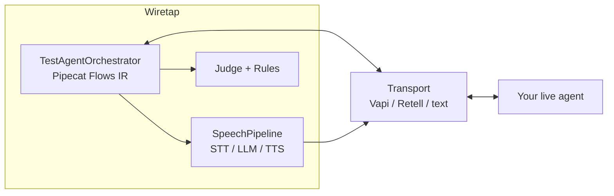

# wiretap — High-Level Design

OSS, CLI-first **voice agent test simulator**. Wiretap dials **your live agent** with a **test agent**, scores the call, and stores artifacts locally under `.wiretap/`.

## 1. Product thesis

```text
Your live agent  ←── voice/text transport ──→  Wiretap test agent
                                                      │
                                              Pipecat Flows IR
                                              LiteLLM (talk + judge)
                                              STT / TTS adapters
```

- **Import ≠ transport.** Import pulls config/suites; simulate dials the live agent.
- **AgentGraph** is IR only (no local execution of their agent).
- **Secrets** live in `.env` only; suite YAML holds ids + `token_env` names.

## 2. Control plane (orchestrator)

**Pipecat is the test-agent orchestrator.**

| Layer | Role |
| --- | --- |
| `TestAgentOrchestrator` | Control plane for simulate |
| `pipecat.flows.types.NodeConfig` | Flow IR (nodes / role / tasks) |
| Ladder | prompt → beats → multi-node Flows (`flow_phases`) |
| `SpeechPipeline` | STT → LLM → TTS (Pipecat FrameProcessors when available) |
| LiteLLM | Test-agent utterances + judge |

Legacy `Caller` / `FlowCaller` remain importable but are **not** on the simulate path.

Turn-based CLI simulate does **not** spin a full `FlowManager` + `PipelineWorker` (that API expects a streaming Pipecat app). Instead we execute the same Flows **node graph** turn-by-turn against the live transport.

## 3. Runtime path (one simulation)

```text
suite.yaml
   │
   ▼
simulate_scenario
   ├── build_transport(agent)     # Vapi WS | Retell LiveKit | text stub
   ├── configure_speech(stt/tts)
   ├── build_orchestrator(...)    # Pipecat Flows nodes + SpeechPipeline
   │
   ├── loop max_turns
   │     transport.receive()  → agent text
   │     orchestrator.next_utterance()  → test-agent text (+ beats / node transitions)
   │     transport.send_text()  → TTS into live call when voice
   │
   ├── check_caller_contract (--strict → inconclusive)
   ├── run_rules + judge_call (LiteLLM)
   └── SimulationArtifact → .wiretap/simulations/
```

## 4. Media & providers

| Concern | Implementation |
| --- | --- |
| STT | Factory: PyAI, OpenAI, Deepgram, AssemblyAI, Gladia, Groq |
| TTS | Factory: PyAI, OpenAI, Deepgram, Cartesia, ElevenLabs, LMNT, Rime, PlayHT |
| Defaults | LLM OpenAI; STT/TTS **PyAI** (speech-only) |
| Transports | Vapi WebSocket voice (default), Retell LiveKit, text stub; phone/SIP deferred |

## 5. Surfaces

| Surface | Responsibility |
| --- | --- |
| CLI (`wiretap`) | `init \| import \| suite \| simulate \| report \| export \| ui` |
| Local UI | First-run onboarding + agents / suites / evaluations |
| MCP | Optional `wiretap-mcp` wraps core |
| CI | JUnit/JSON; inconclusive = skipped |

## 6. Data layout

```text
.wiretap/
  suites/           # source of truth for scenarios
  simulations/      # SimulationArtifact JSON (never the suite “results in git”)
  graphs/           # imported AgentGraph IR
  onboard.json      # non-secret onboarding prefs
.env                # secrets only
```

## 7. Explicit non-goals / deferred

- Phone / SIP / Bland live dial  
- Owning telephony infra  
- Executing AgentGraph locally  
- Closed cloud product (out of this repo)  
- Azure/Google/AWS speech without full cloud IAM  

## 8. One diagram


