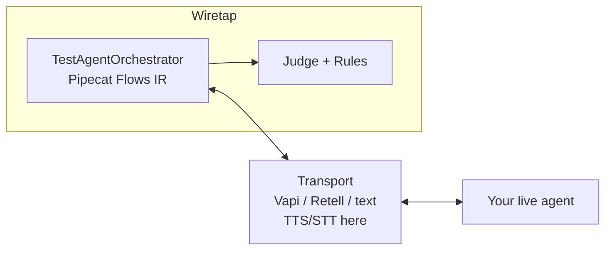

# wiretap — High-Level Design

Wiretap is a CLI that dials **your live voice agent** with a **test agent**, scores the call, and stores results under `.wiretap/`.

## Idea in one picture

```text
Your live agent  ←── transport (Vapi / Retell / text) ──→  Test agent
                                                              │
                                                    Pipecat Flows IR
                                                    LiteLLM (say + judge)
                                                    TTS/STT on transport
```

Three rules:

1. **Import ≠ dial.** Import drafts suites; `simulate` opens the live session.  
2. **AgentGraph is data only.** We never re-run their agent locally.  
3. **Secrets stay in `.env`.** YAML holds ids and `token_env` names.

## Pieces

| Piece | Job |
| --- | --- |
| `TestAgentOrchestrator` | Control plane for what the test agent says |
| Pipecat `NodeConfig` | Flow IR (prompt → beats → `flow_phases`) |
| LiteLLM | Test-agent lines + judge |
| Transport | Session to the live agent; voice TTS/STT here |
| Rules + judge | Pass/fail + fail-only tips |

Pipecat is a **core** dependency. We use Flows as the **node graph IR**. The CLI loop is turn-based against a live transport, so we do **not** run a full `FlowManager` + `PipelineWorker` (that path is for streaming Pipecat apps).

`SpeechPipeline` exists for optional STT→LLM→TTS experiments and tests. **Simulate does not call `SpeechPipeline.reply()`** — voice audio goes through transport `configure_speech` / factory adapters.

## One simulation

```text
suite.yaml
   │
   ▼
simulate_scenario
   ├── build_transport(agent)
   ├── configure_speech(stt/tts)     # voice transports only
   ├── build_orchestrator(...)       # Flows nodes + LiteLLM
   │
   ├── loop (max_turns)
   │     receive agent text
   │     next test-agent utterance (beats / node steps)
   │     send text (TTS on voice transports)
   │
   ├── caller-contract check (--strict → inconclusive)
   ├── rules + LiteLLM judge
   └── SimulationArtifact → .wiretap/simulations/
```

## Speech defaults

| Slot | Default | Notes |
| --- | --- | --- |
| LLM | OpenAI (via LiteLLM) | Simulator + judge model slots |
| STT / TTS | PyAI | Speech-only; not an LLM |

Factory adapters also cover OpenAI, Deepgram, Cartesia, ElevenLabs, and similar HTTP providers.

## Surfaces

| Surface | Role |
| --- | --- |
| CLI | `init \| import \| suite \| simulate \| report \| export \| ui` |
| Local UI | Onboarding + agents / suites / evaluations |
| MCP | Optional `wiretap-mcp` |
| CI | JUnit / JSON; inconclusive → skipped |

## Data layout

```text
.wiretap/
  suites/           # scenario definitions
  simulations/      # artifacts (local; not “results in git”)
  graphs/           # imported AgentGraph IR
  onboard.json      # non-secret prefs
.env                # secrets only
```

## Not in this repo (yet)

- Phone / SIP / Bland live dial  
- Owning telephony  
- Executing AgentGraph locally  
- Cloud SaaS product  

## Diagram


