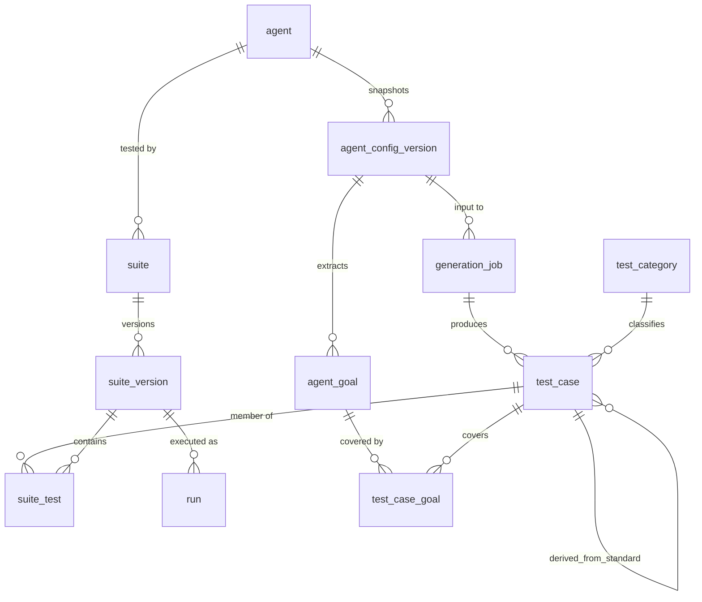

# Test Suite Lifecycle — Agent Import to Suite Execution

**Status:** proposal · **Date:** 2026-08-10 · Companion to `ARCHITECTURE.md`

Covers the flow: *Import Agent → Select Agent → Import Config → Analyze →
Generate Tests → Create Suite → Name → Add Tests → Suite List → Run/Manage.*

`ARCHITECTURE.md` documents the **runtime** (how one call is placed, paced,
transcribed and scored). This document covers the **authoring layer** above it
(how the set of calls to place is decided). They meet at exactly one point:
`run.suite_version_id`.

---

## 1. Coverage audit of existing documentation

Measured by grep over `ARCHITECTURE.md`, not from memory.

| Flow step | Documented? | Where | Gap |
|---|---|---|---|
| 1. Agent import | **Partial** | PRD §7.4 (connect key → list agents → pick one); `list_agents()` in ARCH §9; verified live for Vapi + Retell | No `agent` entity. Nothing persists an imported agent between runs |
| 2. Agent config import | **Partial** | ARCH §3 "Prompt separable from config"; `run.agent_config_sha256`; verified live | Config is *hashed*, never *stored* or *parsed*. No goals, no capability extraction |
| 3. Test generation | **Not covered** | — | PRD §2.2 lists it as an explicit **non-goal**. No generator, no mapping to goals or categories |
| 4. Suite creation | **Not covered** | `run.suite_name` / `suite_version` are free-text strings | No `suite` table, no `test_case` table, no suite↔test relationship |
| 5. Suite management | **Not covered** | `wiretap suites list` named in PRD §11 | No list columns, no detail view, no add/remove/edit |
| 6. End-to-end flow | **Not covered** | — | Steps 1→2 exist as verified API calls; 3→6 do not exist at any layer |

Also missing and required by this flow (already flagged independently as staff
review finding F4): there is no `persona`/`test_case` table at all, so the report
card's per-category and per-difficulty rollups have no source.

**Verdict:** steps 1 and 2 are implemented-but-not-persisted. Steps 3 through 6
do not exist in code, schema, API or UI.

---

## 2. Three collisions this flow creates, and how the design resolves them

These are not edge cases. They are load-bearing decisions the flow reverses, and
each needs an explicit answer or the docs contradict each other.

### C1 — Generation requires the system prompt

PRD §2.2: *"We do not read the user's agent system prompt in v1 — 'we never see
your prompt' is a meaningful trust claim."*

Verified 2026-08-10: on **Vapi this was already false** — the prompt ships in
`model.messages[0].content` on the same `GET /assistant` used for enumeration and
version pinning. On **Retell it is genuinely separable** (`/get-agent` carries no
prompt; only `/get-retell-llm` does).

**Resolution.** Prompt access becomes an explicit, per-agent, logged consent —
not a silent side effect.

- `agent.prompt_access` ∈ `none | transient | stored`.
- `none` — default on Retell. Config-only import. Generation runs from
  structured config (tools, voice, language, endpointing, `firstMessage`) and
  the user-supplied goal statement. Weaker tests, zero prompt exposure.
- `transient` — prompt is read into memory, used for generation, never written
  to disk. Enforced by the §8.8 denylist, which must be extended to include the
  prompt text.
- `stored` — prompt persisted in `agent_config_version.system_prompt`. Required
  for prompt-diffing and for §10.5 prompt-level remediation. Requires an
  attestation row.

The trust claim is restated as the enforceable version: **"your prompt is never
transmitted to a third party except the judge/generator model you selected, and
never persisted unless you choose `stored`."**

### C2 — Generated adversarial tests have no citation

PRD §15.5: *"core-50@v1 contains only already-public, cited techniques — every
adversarial and compliance persona carries a citation. This keeps the shipped
corpus out of Tier 2 by construction, and it materially reduces model-provider
AUP exposure (§15.11)."*

**Resolution.** `test_case.origin` and `test_case.citation` carry the posture.

- `origin='standard'` — from the frozen corpus, `citation` NOT NULL, publishable.
- `origin='generated'` — `citation` NULL. Generated cases in the `adversarial`
  and `compliance` categories are **restricted to instantiating a cited standard
  technique with agent-specific surface detail** (domain vocabulary, product
  names, plausible requests). The generator is never asked to invent a novel
  attack; it is asked to dress a cited one. `test_case.derived_from_standard_id`
  records which technique, so the citation chain survives.
- A suite containing any `origin='generated'` case is marked
  `publishable = 0`. The publish path refuses it.

This keeps §15.11 satisfied: the LLM is not being asked to produce novel
jailbreaks, and the §15.4 ownership attestation supplies the "authorization of
the system owner" basis.

### C3 — A generated suite is not reproducible the way a frozen one is

Today `suite_version` means `core-50@v1` — frozen, hash-pinned, identical for
every user. A generated suite is an LLM output: non-deterministic, per-agent,
unshareable.

**Resolution.** Reproducibility moves from *the corpus* to *the suite version*.

- Once created, a `suite_version` is **immutable**. Any edit — add, remove,
  reorder, regenerate — creates a new `suite_version`.
- `run.suite_version_id` pins it. The §5 comparison guard extends: `wiretap compare`
  refuses across differing `suite_version_id` exactly as it refuses across
  differing agent-version tuples.
- `suite_version.content_sha256` goes into the replication bundle in place of
  `persona_set_sha256` for generated suites.
- `generation_job` records model, version, temperature, seed, prompt template
  version, and the input hash — so a generation is auditable even though it is
  not repeatable.

---

## 3. Entity model



### 3.1 DDL

```sql
-- An agent imported from a vendor account. Survives across runs.
CREATE TABLE agent (
  id              TEXT PRIMARY KEY,               -- internal uuid
  vendor          TEXT NOT NULL,                  -- vapi | retell | pyai | local-demo
  external_id     TEXT NOT NULL,                  -- vendor's assistant/agent id
  display_name    TEXT NOT NULL,
  prompt_access   TEXT NOT NULL DEFAULT 'none'
                    CHECK (prompt_access IN ('none','transient','stored')),  -- C1
  imported_at     INTEGER NOT NULL,
  last_seen_at    INTEGER NOT NULL,
  archived        INTEGER NOT NULL DEFAULT 0,
  UNIQUE (vendor, external_id)                    -- re-import is idempotent
);
```

```sql
-- Immutable snapshot of a fetched config. Never updated; a change creates a row.
CREATE TABLE agent_config_version (
  id                  TEXT PRIMARY KEY,
  agent_id            TEXT NOT NULL REFERENCES agent(id) ON DELETE CASCADE,
  fetched_at          INTEGER NOT NULL,
  config_sha256       TEXT NOT NULL,              -- over the normalized config
  vendor_version      TEXT,                       -- vapi latestVersion / retell int version
  raw_config_json     TEXT NOT NULL,              -- prompt REMOVED from this blob
  system_prompt       TEXT,                       -- NULL unless prompt_access='stored'
  prompt_sha256       TEXT,                       -- always set; enables drift detection
                                                  -- without storing the text
  -- extracted, structured
  model_provider TEXT, model_name TEXT, model_temperature REAL,
  voice_provider TEXT, voice_id TEXT,
  transcriber_provider TEXT, transcriber_model TEXT,
  language            TEXT,
  first_message       TEXT,
  end_call_phrases    TEXT,                       -- JSON array — persona linter reads this
  tools_json          TEXT,                       -- JSON array of {name,type,irreversible}
  capabilities_json   TEXT,                       -- dtmf, barge-in knobs, side effects
  latency_config_json TEXT,                       -- waitSeconds, endpointing, sensitivity
  UNIQUE (agent_id, config_sha256)
);
CREATE INDEX idx_acv_agent ON agent_config_version(agent_id, fetched_at DESC);
```

`prompt_sha256` is always recorded even when the prompt is not stored. That is
what makes "the agent's prompt changed since this suite was generated" detectable
under `prompt_access='none'`.

```sql
-- Goals derived from the config. The unit tests are mapped against.
CREATE TABLE agent_goal (
  id              TEXT PRIMARY KEY,
  config_version_id TEXT NOT NULL REFERENCES agent_config_version(id) ON DELETE CASCADE,
  seq             INTEGER NOT NULL,
  statement       TEXT NOT NULL,                  -- "Schedule, reschedule and cancel appointments"
  kind            TEXT NOT NULL CHECK (kind IN
                    ('primary_task','constraint','policy','escalation','capability','persona_trait')),
  source          TEXT NOT NULL CHECK (source IN ('extracted','user_supplied')),
  evidence        TEXT,                           -- where in the config it came from
  UNIQUE (config_version_id, seq)
);
```

```sql
-- The 7 predefined categories from PRD 6.4, as data not code.
CREATE TABLE test_category (
  id              TEXT PRIMARY KEY,               -- emotional|linguistic|adversarial|operational|
                                                  -- factual|compliance|task
  display_name    TEXT NOT NULL,
  description     TEXT NOT NULL,
  default_weight  REAL NOT NULL DEFAULT 1.0,      -- suite composition target
  is_control      INTEGER NOT NULL DEFAULT 0,     -- task category = controls
  requires_citation INTEGER NOT NULL DEFAULT 0    -- adversarial + compliance = 1  (C2)
);
```

```sql
CREATE TABLE test_case (
  id              TEXT PRIMARY KEY,
  origin          TEXT NOT NULL CHECK (origin IN ('standard','generated','manual')),
  category_id     TEXT NOT NULL REFERENCES test_category(id),
  difficulty_tier INTEGER NOT NULL CHECK (difficulty_tier BETWEEN 1 AND 5),
  name            TEXT NOT NULL,
  locale          TEXT NOT NULL DEFAULT 'en-US',

  behavior_prompt TEXT,                           -- LIVE mode
  beat_spine_json TEXT NOT NULL,                  -- ordered beats: text, after, delay_ms
  assertions_json TEXT NOT NULL,                  -- typed assertions, blocking flags
  requires_capability TEXT,                       -- JSON array, drives auto-skip
  expected_on_interrupt TEXT CHECK (expected_on_interrupt IN ('yield','resume')),

  -- provenance / legal posture (C2)
  citation        TEXT,                           -- NOT NULL for standard adversarial/compliance
  derived_from_standard_id TEXT REFERENCES test_case(id),
  generation_job_id TEXT REFERENCES generation_job(id),
  agent_id        TEXT REFERENCES agent(id),      -- NULL for standard corpus (shared)

  fingerprint     TEXT NOT NULL,                  -- sha256(normalized beats + assertions)
  created_at      INTEGER NOT NULL
);
CREATE INDEX idx_tc_cat ON test_case(category_id, difficulty_tier);
CREATE INDEX idx_tc_fp  ON test_case(fingerprint);
CREATE INDEX idx_tc_agent ON test_case(agent_id) WHERE agent_id IS NOT NULL;
```

```sql
-- Which goals each test exercises. This is the "maps to the agent's goals" record.
CREATE TABLE test_case_goal (
  test_case_id  TEXT NOT NULL REFERENCES test_case(id) ON DELETE CASCADE,
  goal_id       TEXT NOT NULL REFERENCES agent_goal(id) ON DELETE CASCADE,
  rationale     TEXT,                             -- one line, shown in the UI
  PRIMARY KEY (test_case_id, goal_id)
);
```

```sql
CREATE TABLE generation_job (
  id                TEXT PRIMARY KEY,
  agent_id          TEXT NOT NULL REFERENCES agent(id) ON DELETE CASCADE,
  config_version_id TEXT NOT NULL REFERENCES agent_config_version(id),
  status            TEXT NOT NULL CHECK (status IN ('running','succeeded','failed','partial')),
  -- auditability, since generation is not repeatable (C3)
  model             TEXT NOT NULL, model_version TEXT, temperature REAL, seed INTEGER,
  template_version  TEXT NOT NULL,                -- our generation prompt version
  input_sha256      TEXT NOT NULL,                -- config + goals + category targets
  used_prompt       INTEGER NOT NULL,             -- did it see the system prompt? (C1)
  requested_counts_json TEXT NOT NULL,            -- {"adversarial":8,"linguistic":8,...}
  produced_counts_json  TEXT,
  rejected_counts_json  TEXT,                     -- by validator reason
  cost_usd          REAL,
  started_at        INTEGER NOT NULL, ended_at INTEGER,
  error             TEXT
);
```

```sql
CREATE TABLE suite (
  id            TEXT PRIMARY KEY,
  agent_id      TEXT NOT NULL REFERENCES agent(id) ON DELETE CASCADE,
  name          TEXT NOT NULL,
  name_source   TEXT NOT NULL CHECK (name_source IN ('auto','user')),
  created_at    INTEGER NOT NULL,
  archived      INTEGER NOT NULL DEFAULT 0,
  UNIQUE (agent_id, name)                         -- duplicate-name guard
);
```

```sql
-- Immutable. Any edit creates a new version. (C3)
CREATE TABLE suite_version (
  id                TEXT PRIMARY KEY,
  suite_id          TEXT NOT NULL REFERENCES suite(id) ON DELETE CASCADE,
  version           INTEGER NOT NULL,
  config_version_id TEXT NOT NULL REFERENCES agent_config_version(id),
  generation_job_id TEXT REFERENCES generation_job(id),
  change_reason     TEXT NOT NULL CHECK (change_reason IN
                      ('initial','regenerated','manual_edit','config_drift','imported')),
  parent_version_id TEXT REFERENCES suite_version(id),
  content_sha256    TEXT NOT NULL,                -- over ordered member fingerprints
  test_count        INTEGER NOT NULL,
  publishable       INTEGER NOT NULL,             -- 0 if any generated member (C2)
  created_at        INTEGER NOT NULL,
  UNIQUE (suite_id, version),
  UNIQUE (suite_id, content_sha256)               -- duplicate-content guard
);
```

```sql
CREATE TABLE suite_test (
  suite_version_id TEXT NOT NULL REFERENCES suite_version(id) ON DELETE CASCADE,
  test_case_id     TEXT NOT NULL REFERENCES test_case(id),
  seq              INTEGER NOT NULL,
  enabled          INTEGER NOT NULL DEFAULT 1,
  added_by         TEXT NOT NULL CHECK (added_by IN ('generator','standard_pack','user')),
  fingerprint      TEXT NOT NULL,                 -- denormalized for the dup guard
  PRIMARY KEY (suite_version_id, test_case_id),
  UNIQUE (suite_version_id, fingerprint),         -- duplicate-test guard
  UNIQUE (suite_version_id, seq)
);
```

### 3.2 Change to `run`

```sql
ALTER TABLE run ADD COLUMN suite_version_id TEXT REFERENCES suite_version(id);
ALTER TABLE run ADD COLUMN agent_ref_id     TEXT REFERENCES agent(id);
-- run.suite_name / run.suite_version remain for the frozen core-50 path
```

`run.agent_config_sha256` must equal
`suite_version.config_version_id → config_sha256` at dial time, or the run is
flagged `config_drift` (§6, edge case E1).

---

## 4. Test generation pipeline

Five stages. Only stage 3 involves an LLM.

```
1 EXTRACT    config → structured facts + candidate goals
2 PLAN       goals × categories × difficulty → a target matrix (deterministic)
3 GENERATE   per cell: instantiate a standard technique with agent specifics
4 VALIDATE   schema, linter, dedup, citation rule, safety class
5 ASSEMBLE   ordered suite_version + suite_test rows
```

### Stage 1 — Extract

Deterministic parsing, no LLM. Produces `agent_config_version` columns plus
candidate `agent_goal` rows. Sources, verified available on both vendors:

| Signal | Vapi | Retell |
|---|---|---|
| Goals / role | `model.messages[0].content` (prompt) | `general_prompt` |
| Opening behaviour | `firstMessage` | `begin_message` / `start_speaker` |
| Tools & side effects | `model.tools[]` | `general_tools[]` |
| Stop words | `endCallPhrases` | `end_call` tool |
| Barge-in tuning | `startSpeakingPlan`, `stopSpeakingPlan` | `interruption_sensitivity` |
| DTMF | — | `allow_user_dtmf` |
| Language | `transcriber.language` | `language` |
| KB grounding | — | `kb_config` |

Under `prompt_access='none'`, goals come from the structured fields plus a
required user-supplied goal statement in the UI. The suite is smaller and the
`factual` category is largely unavailable — document that tradeoff to the user at
the point of choice, not afterward.

### Stage 2 — Plan (deterministic)

The target matrix is computed, not generated, so suite composition is
reproducible even though the test bodies are not.

```
targets[category] = round(total × category.default_weight / Σweights)
```

Default totals follow PRD §6.4's nightmare-first ratio — emotional 8,
linguistic 8, adversarial 8, operational 8, factual 8, compliance 6, task 4.
Adjustments applied deterministically from config facts:

- no tools → drop tool-invocation cases, redistribute to `factual`
- `allow_user_dtmf=false` and WebSocket transport → mark DTMF cases
  `requires_capability=['dtmf']` so they auto-skip rather than fail
- `language != en` → shift `linguistic` toward that locale's code-switch pairs
- irreversible tools present → force `operational` escalation cases into the plan
- goals count < 3 → cap `task` at 2, warn the user their goals are thin

Each planned cell records `(category, difficulty_tier, goal_id, technique_id)`.
`technique_id` points at a standard corpus case — which is what makes C2's
citation chain work.

### Stage 3 — Generate

One LLM call per cell, or batched per category. Input: the technique's beat
skeleton, the goal statement, the industry/business context, and the extracted
config facts. Output: a `test_case` row conforming to the persona schema.

The generator is constrained to **instantiate, not invent**. It may rewrite beat
text into the agent's domain and add domain-plausible detail. It may not
introduce a new attack class, and for `requires_citation` categories the
resulting case must remain recognisably the cited technique — enforced in stage 4.

Judge/generator model, temperature, seed and template version are all recorded on
`generation_job`.

### Stage 4 — Validate

Every generated case passes all of these or is rejected with a reason counted in
`rejected_counts_json`:

| Check | Rule |
|---|---|
| Schema | beats and assertions parse; ≥1 blocking assertion |
| Stop-word linter | no beat text contains the agent's `endCallPhrases` or a farewell — verified real: Vapi hangs up on "goodbye" |
| Dedup | `fingerprint` not already present in this suite version |
| Citation | `requires_citation` category ⇒ `derived_from_standard_id` NOT NULL |
| Safety class | not a novel attack; matches the technique's declared class (C2) |
| Capability | `requires_capability` ⊆ adapter's declared capabilities, else marked skip |
| Goal mapping | ≥1 `test_case_goal` row, else rejected as unmapped |
| Length | beat count ≤ turn cap (default 12) |

### Stage 5 — Assemble

Creates `suite_version` (version 1, `change_reason='initial'`), inserts
`suite_test` rows in planned order, computes `content_sha256`, sets
`publishable = 0` if any member has `origin='generated'`.

**Auto-naming.** `{AgentName} — {ConfigShortHash} — {N} tests — {YYYY-MM-DD}`,
e.g. `Riley — a3f91c — 46 tests — 2026-08-10`. Includes the config hash so two
suites for the same agent at different config versions are distinguishable at a
glance. User-supplied names override; `name_source` records which.

---

## 5. APIs and services

### 5.1 Services

| Service | Responsibility |
|---|---|
| `AgentImporter` | `list_agents()` per adapter → upsert `agent` rows |
| `ConfigSnapshotter` | fetch config → normalize → `agent_config_version` (+ prompt policy) |
| `GoalExtractor` | config → `agent_goal[]` |
| `SuitePlanner` | goals × categories → deterministic target matrix |
| `TestGenerator` | matrix → `test_case[]` (the only LLM stage) |
| `TestValidator` | stage-4 rules |
| `SuiteAssembler` | `suite` + `suite_version` + `suite_test` |
| `SuiteRegistry` | list, open, diff, archive, resolve → RunEngine |

`SuiteRegistry.resolve(suite_version_id)` returns the ordered test list that
`RunEngine.run()` consumes. This is the single seam between authoring and
runtime — everything above is new; nothing below `RunEngine` changes.

### 5.2 HTTP surface (local UI) and CLI parity

Every route is a thin wrapper over a service, per ARCH §2's layering rule.

| Method | Route | CLI equivalent |
|---|---|---|
| `POST` | `/v1/providers/{vendor}/import` | `wiretap providers add <vendor>` |
| `GET` | `/v1/agents` | `wiretap agents list` |
| `POST` | `/v1/agents/{id}/config:snapshot` | `wiretap agents snapshot <id>` |
| `GET` | `/v1/agents/{id}/config/{cvid}/goals` | `wiretap agents goals <id>` |
| `POST` | `/v1/agents/{id}/suites:generate` | `wiretap suite generate --agent <id>` |
| `GET` | `/v1/suites` | `wiretap suites list` |
| `GET` | `/v1/suites/{id}` | `wiretap suite show <id>` |
| `GET` | `/v1/suites/{id}/versions` | `wiretap suite versions <id>` |
| `POST` | `/v1/suites/{id}/versions` | `wiretap suite edit <id>` |
| `POST` | `/v1/suites/{id}:regenerate` | `wiretap suite regenerate <id>` |
| `GET` | `/v1/suites/{a}/diff/{b}` | `wiretap suite diff <a> <b>` |
| `POST` | `/v1/runs` (body: `suite_version_id`) | `wiretap run --suite-version <id>` |

`POST …:generate` is long-running: returns `202` with a `generation_job` id;
progress streams over the existing SSE channel.

---

## 6. UI flow

```
Providers ──▶ Agents ──▶ Agent detail ──▶ Generate ──▶ Suite detail ──▶ Run
                                              │
                                        Suite list ◀────────┘
```

**Agents list.** Name · vendor · external id · config version · last snapshot ·
suite count · prompt-access badge. Action: *Test this agent*.

**Agent detail / pre-generation.** Shows extracted goals for confirmation (the
user can edit, add, or remove — these are the mapping targets), the category
target matrix with counts, industry selector, business context, prompt-access
choice with its consequence stated inline, and the estimated cost and duration of
a full run of the resulting suite.

**Suite list** — required columns:

| Column | Source |
|---|---|
| Suite name | `suite.name` |
| Agent | `agent.display_name` + vendor badge |
| Tests | `suite_version.test_count` (enabled / total) |
| Categories | chips with per-category counts |
| Version | `v{n}` + `change_reason` |
| Config status | **green** in sync · **amber** agent config changed since generation |
| Created | `suite.created_at` |
| Last updated | latest `suite_version.created_at` |
| Last run | status pill + score, or *never run* |
| Publishable | lock icon when `publishable=0`, tooltip naming the reason |

Sort by last updated; filter by agent, category, config status.

**Suite detail.** Header with the above plus *Run*, *Regenerate*, *Duplicate*,
*Export*. Body is the test table: seq · name · category · tier · goals covered ·
origin badge (standard/generated/manual) · citation link · enabled toggle ·
last result. Row click opens the test (beats, assertions, and if it has run, the
timeline from ARCH §12). Bulk enable/disable. Add test — from the standard
corpus, or authored manually. Any change composes into a **pending diff** and is
committed as one new `suite_version` with `change_reason='manual_edit'`.

---

## 7. End-to-end sequence

```
User                UI            Services                     Vendor      DB
 │  connect key ───▶ │
 │                   │─ AgentImporter.list_agents() ──────────▶ GET agents
 │                   │◀─ upsert agent[] ───────────────────────────────────▶ agent
 │  select agent ──▶ │
 │                   │─ ConfigSnapshotter.snapshot() ─────────▶ GET config
 │                   │   normalize · strip prompt per policy
 │                   │◀────────────────────────────────────────────────────▶ agent_config_version
 │                   │─ GoalExtractor.extract() ──────────────────────────▶ agent_goal[]
 │  confirm goals ─▶ │
 │  + categories     │─ SuitePlanner.plan()            (deterministic)
 │                   │─ TestGenerator.generate() ──────────────▶ LLM ─────▶ generation_job
 │                   │─ TestValidator.validate()       (reject + count)
 │                   │─ SuiteAssembler.assemble() ────────────────────────▶ suite
 │                   │                                                     suite_version v1
 │                   │                                                     suite_test[]
 │  name suite ────▶ │  (or auto-name)
 │  ◀── suite list ──│─ SuiteRegistry.list()
 │  open suite ────▶ │─ SuiteRegistry.get()
 │  run ───────────▶ │─ SuiteRegistry.resolve(sv_id) ──▶ RunEngine.run() ─▶ run(suite_version_id)
```

---

## 8. Edge cases

### E1 — Agent config changes after suite creation

`suite_version` pins `config_version_id`. On opening a suite, and again at
pre-flight, re-snapshot and compare `config_sha256` and `prompt_sha256`.

- Unchanged → green.
- Changed → amber "agent config changed since this suite was generated", with a
  field-level diff (prompt shown as changed/unchanged only when
  `prompt_access='none'`). Offer *Regenerate*, *Keep as-is*, or *Pin*.
- Running anyway is allowed but the run records `config_drift=1`, and any
  comparison against a pre-drift run is refused with an explanation — same rule
  as the agent-version guard in ARCH §5.

### E2 — Re-generating tests

Never mutates. Creates a new `generation_job` and a new `suite_version` with
`change_reason='regenerated'` and `parent_version_id` set. The UI shows a
three-way diff — kept (fingerprint match), dropped, added. Manually added tests
(`added_by='user'`) are **carried forward by default** with a checkbox to drop
them; regeneration losing hand-written tests silently is the worst failure here.
Prior versions remain runnable.

### E3 — Duplicate suites

- Same name for the same agent → blocked by `UNIQUE (agent_id, name)`; the UI
  offers to open the existing one or auto-suffix.
- Same *content* → blocked by `UNIQUE (suite_id, content_sha256)`. If a
  regeneration produces byte-identical content, no new version is created and
  the UI says "regeneration produced no changes."
- Same content under a *different* suite → allowed but surfaced: "an identical
  suite already exists for this agent."
- Explicit *Duplicate* action → new `suite` row, copies the latest version as
  v1, `change_reason='imported'`.

### E4 — Duplicate tests

`test_case.fingerprint` = sha256 over normalized beat text plus the sorted
assertion set. Normalization matches ARCH §9.3 (lowercase, punctuation stripped,
whitespace collapsed, digits spelled) so near-identical generations collapse.
`UNIQUE (suite_version_id, fingerprint)` makes duplicates unrepresentable within
a version. Stage 4 rejects and counts them rather than erroring the job. Across
suites duplicates are fine and expected — the standard corpus is shared.

### E5 — User manually adding or removing tests

Adds create `test_case` rows with `origin='manual'`, `agent_id` set, no citation
— which sets `publishable=0` for any version containing them. Removals are
version-level, never deletes: the `test_case` row survives, the `suite_test` row
is absent from the new version. Disable (`enabled=0`) is distinct from remove —
disabled tests stay visible, count in "total" but not "enabled", and are recorded
`not_executed`, never `0` (ARCH §6.1). All edits batch into one new version.

### E6 — Different test categories

Categories are rows in `test_category`, not an enum, so a user pack can add one
without a migration. Per-category composition targets are set at generation and
recorded on `generation_job.requested_counts_json`, so "why does this suite have
9 adversarial tests" is answerable later. Report-card rollups group on
`test_case.category_id` — which also closes staff-review finding F4. Categories
with `requires_citation=1` are subject to the C2 rule; a user-added category
defaults to `requires_citation=1` (fail safe).

### E7 — Versioning

Three independent version axes, all pinned on `run`:

| Axis | Column | Guard |
|---|---|---|
| Agent config | `agent_config_version.config_sha256` + `vendor_version` | E1 drift check |
| Suite | `suite_version.version` + `content_sha256` | comparison refused across versions |
| Scorer | `run_score.scorer_version` (staff-review F5) | comparison refused across versions |

`wiretap compare A B` refuses unless all three match, and names which one differs.
Refusing loudly is the point: a silent 6-point drop caused by a regenerated
suite is exactly the bug that discredits the tool.

### E8 — Re-running an existing suite

A run always targets a `suite_version_id`, so re-running is unambiguous. The
suite detail page lists prior runs with score, date, config status and scorer
version. "Run again" reuses the same `suite_version`; caller audio comes from the
SHA-256 cache, so a re-run is cheaper — only the vendor's meter, no TTS.

Two guards. Re-running a version whose `config_version_id` no longer matches the
live agent proceeds only with the E1 acknowledgement. And re-running does **not**
overwrite prior results — each is a distinct `run`, which is what makes the
measured score-stability number in ARCH §5 computable at all.

---

## 9. Open questions

| # | Question | Blocks |
|---|---|---|
| S1 | Is generation in scope for the 33-hour build, or v1.1? Staff review already cuts 16 tables to 8; this adds 8 more | Whether any of §4 is built now |
| S2 | Does the standard corpus stay a YAML pack on disk, or move into `test_case` rows seeded at first run? | Whether `core-50@v1` and generated suites share one code path |
| S3 | Goal extraction quality under `prompt_access='none'` — is a structured-config-only suite actually useful, or a false promise? | Whether Retell users get a degraded product |
| S4 | Who owns the generation prompt template, and how is `template_version` reviewed? | C2's safety-class enforcement is only as good as the template |
