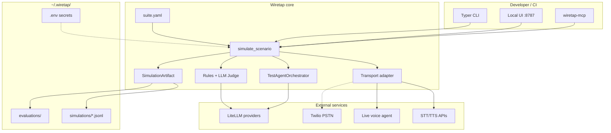

# Architecture

This document describes Wiretap's system architecture: purpose, components, data flow, interfaces, and platform integrations.

---

## 1. Purpose and scope

Wiretap is an **automated QA harness for live voice agents**. It does not build, host, or execute your agent. Instead it:

1. **Imports** configuration from voice platforms (Retell, Vapi, ElevenLabs, LiveKit, Synthflow, Bland, Bolna) or accepts hand-written suites
2. **Generates** categorized test scenarios (emotional, adversarial, compliance, operational, etc.)
3. **Dials the live deployed agent** via WebSocket, LiveKit room, or real phone (Twilio PSTN)
4. **Simulates a test caller** — an LLM-driven persona with optional beats and flow phases
5. **Records** transcripts, audio (WAV), and tool-call evidence
6. **Scores** with deterministic rules + LLM judge (temperature 0.0)
7. **Stores results** locally under `~/.wiretap/`

**In scope:** Point-in-time regression testing, pre-release QA, CI integration (user-provided pipeline).

**Out of scope:** Production monitoring, hosted SaaS, local agent emulation, telephony infrastructure ownership.

---

## 2. Tech stack

| Layer | Technology |
|-------|------------|
| Language | Python ≥ 3.11 |
| Packaging | uv + Hatchling |
| CLI | Typer + Rich |
| Schemas | Pydantic v2 |
| LLM | LiteLLM (simulator, judge, advisor, suite generation) |
| HTTP client | httpx |
| Local API / UI backend | FastAPI + uvicorn |
| Voice transports | websockets, LiveKit SDK, pyVoIP (PSTN, optional extra) |
| Default STT/TTS | pyai-sdk (PyAI) |
| Frontend | React 19, TypeScript, Vite, Tailwind 4, Radix/shadcn |
| Optional | MCP server (`wiretap-mcp`), Twilio PSTN (`uv sync --extra pstn`) |
| Persistence | Filesystem only — JSONL + YAML (no database) |
| Lint / test | Ruff, pytest, respx, oxlint (UI) |

---

## 3. Repository structure

```text
wiretap/
├── src/wiretap/              # Core Python package
│   ├── cli/                  # Typer commands (init, import, simulate, report, export, ui, suite)
│   ├── agent/                # TestAgentOrchestrator, simulate_scenario loop, beats
│   ├── transport/            # Live dial adapters (Vapi, Retell, ElevenLabs, LiveKit, PSTN, text)
│   ├── providers/            # LLM, STT/TTS factory, catalogs, HTTP retry
│   ├── eval/                 # Judge, rules, meta-check, advisor, concurrency caps
│   ├── importers/            # Platform → SuiteConfig + AgentGraph IR
│   ├── services/             # UI/MCP orchestration (batches, secrets, onboard, Twilio)
│   ├── suite/                # YAML load/save, artifacts, evaluations, run progress, audio
│   ├── toolcalls/            # Post-call tool evidence (Retell, Vapi, ElevenLabs)
│   ├── prompts/              # Judge, advisor, suite generation, category templates
│   ├── mcp/                  # MCP server + tools
│   ├── ui/                   # FastAPI app + built static SPA
│   ├── models.py             # Shared Pydantic schemas
│   └── paths.py              # ~/.wiretap layout
├── ui/                       # React SPA source → builds to src/wiretap/ui/static/
├── tests/                    # ~65 test files, ~380 test functions
└── docs/                     # Architecture and design documentation
```

---

## 4. System context



---

## 5. Core components

### 5.1 TestAgentOrchestrator

Turn-based policy for what the simulated test caller says. Supports a three-level ladder:

| Level | Mechanism | Use case |
|-------|-----------|----------|
| **Prompt** | Persona + goal + rubric in suite YAML | Default — LLM generates natural replies |
| **Beats** | Pin `say` / `must_include` at `at_turn` / `after_turns` | CI / critical line enforcement |
| **Phases** | Ordered `flow_phases` (FlowNode graph) | Multi-step scripted conversations |

The orchestrator exposes `observe_agent()` and `next_utterance()` — the same seam regardless of level.

### 5.2 Transport layer

`build_transport()` selects an adapter based on platform and transport kind:

| Platform | Transport | Mechanism |
|----------|-------------|-----------|
| Vapi | WebSocket (default) | PCM voice via WebSocket; TTS in, transcript out |
| Vapi | text | Text chat fallback |
| Retell | LiveKit | Web call via LiveKit room |
| ElevenLabs | WebSocket | ConvAI WebSocket |
| LiveKit Agents | LiveKit | Room-based agent dial |
| Synthflow | WebSocket | WebSocket media |
| Bland / Bolna | — | Import/IR only; dial via PSTN |
| Custom | text | Local echo stub for CI |
| Any E.164 | pstn | Twilio SIP softphone (optional extra) |

**AgentTurnGate** provides shared VAD (voice activity detection) + batch STT for voice transports, handling silence endpointing so the test agent responds at the right moment.

### 5.3 Evaluation pipeline

Scoring runs after each simulation completes:

```text
Transcript + tool evidence
        │
        ├── Caller contract check (--strict → inconclusive on harness fault)
        ├── Deterministic rules (includes / excludes / regex patterns)
        ├── LLM judge (goal-match score 0–1, temperature 0.0)
        ├── Tool verification (expected vs observed tool calls)
        └── Regression flag (vs previous passing baseline)
                │
                ▼
        Verdict: fail | partial | pass | inconclusive
        Suggestions: fail-only judge tips + optional run-level advisor
```

**Verdict bands** (default pass threshold 0.7):

- **fail** — score < 0.5
- **partial** — 0.5 ≤ score < 0.7
- **pass** — score ≥ 0.7
- **inconclusive** — harness fault, judge outage, invalid regex, strict contract violation

### 5.4 Importers and AgentGraph IR

Importers fetch platform agent configuration and produce:

- A draft `SuiteConfig` YAML with sample scenarios
- An `AgentGraph` JSON file (intermediate representation, **data only**)

AgentGraph IR is used for context during suite generation and prompt advice. It is **never executed** — Wiretap always dials the live agent.

Sensitive fields (webhook URLs, auth headers, tokens) are stripped from imported tool definitions.

### 5.5 Services layer

Orchestration for UI and MCP surfaces:

| Service | Responsibility |
|---------|----------------|
| `batches.py` | In-memory batch state, SSE event stream, parallel scenario execution |
| `secrets.py` | Read/write `~/.wiretap/.env`, status checks (never returns values) |
| `suites.py` | CRUD for suite YAML via API |
| `simulations.py` | Artifact lookup, audio serving |
| `onboard.py` | First-run wizard state |
| `twilio.py` | PSTN number provisioning, SIP credential management |
| `prompt_apply.py` | Preview and apply judge-suggested prompt fixes to live agents |

---

## 6. Simulation lifecycle

One scenario execution (`simulate_scenario`):

```text
1. Build transport from suite.agent config
2. Configure STT/TTS on transport (voice only)
3. Build TestAgentOrchestrator (persona + beats/phases)
4. Connect to live agent
5. Turn loop (max_turns):
     a. receive() — wait for agent utterance (VAD + STT on voice)
     b. observe_agent() — feed to orchestrator
     c. next_utterance() — LLM or beat/phase step
     d. send_text() — TTS prefetch on voice transports
6. Hang up (finally block — always runs)
7. Optionally fetch provider final transcript
8. Save WAV audio recording
9. Collect post-call tool evidence (Retell/Vapi/ElevenLabs)
10. Caller contract check
11. Run deterministic rules
12. LLM judge scoring
13. Regression comparison vs baseline
14. Persist SimulationArtifact to daily JSONL
```

Each scenario is fully isolated: its own transport session, orchestrator instance, and artifact. Parallel runs share only an asyncio semaphore for concurrency control.

---

## 7. Data model

### 7.1 Storage layout

```text
~/.wiretap/                          # or $WIRETAP_HOME
  .env                               # Secrets (chmod 600 on write)
  onboard.json                       # Non-secret onboarding prefs
  suites/
    {name}.yaml                      # SuiteConfig — scenarios, agent, personas
  graphs/
    {agent_id}.json                  # AgentGraph IR from import
  simulations/
    {YYYY-MM-DD}.jsonl               # Append-only daily artifact log
  evaluations/
    {batch_id}.json                  # Batch summary
    {batch_id}.progress.json         # Atomic progress sidecar (CLI ↔ UI)
```

**Precedence for data root** (`paths.py`):

1. Explicit `cwd` → `{cwd}/.wiretap` (tests / isolation)
2. `$WIRETAP_HOME` env → that path
3. `~/.wiretap` (default)

### 7.2 Key schemas (`models.py`)

| Model | Purpose |
|-------|---------|
| `SuiteConfig` | Agent target, personas, scenarios, models, rules |
| `Scenario` | Single test case: persona, goal, beats, rules, expected tools |
| `Persona` | Caller identity: name, tone, background |
| `SimulationArtifact` | Full call record: transcript, audio path, judge result, metrics |
| `JudgeResult` | Score, verdict, reason, suggestions |
| `TurnRecord` | Single turn: role, text, timing (start_ms, end_ms) |
| `BatchRecord` | UI batch metadata and scenario list |

Suite YAML stores platform IDs and `token_env` names — **never secret values**.

---

## 8. Interfaces

### 8.1 CLI commands

| Command | Purpose |
|---------|---------|
| `wiretap init` | First-run wizard (simulator → agent → suite → phone) |
| `wiretap import {platform}` | Pull platform agent + draft suite |
| `wiretap suite {list\|show\|generate\|…}` | Manage test suites |
| `wiretap simulate` | Run live calls (`--all`, `--scenario`, `--transport`, `--concurrency`) |
| `wiretap report` | Summarize artifacts |
| `wiretap export` | Copy suite out for git/CI |
| `wiretap ui run` | Local dashboard (default `127.0.0.1:8787`) |
| `wiretap status` | Config presence check (no secret values) |

### 8.2 REST API (FastAPI)

Bound to localhost by default. Key route groups:

| Group | Routes | Purpose |
|-------|--------|---------|
| Health | `GET /api/health` | Version, paths, secret file existence |
| Secrets | `GET/POST /api/secrets` | Status and managed key writes |
| Onboarding | `POST /api/onboard/*` | Caller, connect, generate flows |
| Suites | `GET/POST/PUT/DELETE /api/suites/*` | Suite CRUD |
| Batches | `POST /api/batches`, `GET …/events` (SSE) | Start runs, stream progress |
| Evaluations | `GET /api/evaluations/*` | Batch results, prompt preview/apply |
| Simulations | `GET /api/simulations/*` | Artifact detail, audio playback |
| PSTN | `GET/POST /api/pstn/*`, `/api/twilio/*` | Phone number management |

Static SPA served at `/` when built into `src/wiretap/ui/static/`.

### 8.3 MCP tools

Available via `wiretap-mcp` for coding-agent integration:

`list_suites`, `get_suite`, `export_suite`, `list_simulations`, `get_simulation`, `list_evaluations`, `get_evaluation`, `list_categories`, `simulate_suite`, `generate_suite`, `fill_suite_scenarios`, `import_agent`, `import_livekit_agent`

---

## 9. Configuration

### 9.1 Environment variables

Primary secret store: `~/.wiretap/.env`

| Category | Variables |
|----------|-----------|
| LLM | `OPENAI_API_KEY`, `ANTHROPIC_API_KEY`, + LiteLLM provider keys |
| Speech | `PYAI_API_KEY` (default), `DEEPGRAM_API_KEY`, `CARTESIA_API_KEY`, `ELEVENLABS_API_KEY`, etc. |
| Platforms | `RETELL_API_KEY`, `VAPI_API_KEY`, `LIVEKIT_*`, `SYNTHFLOW_*`, `BLAND_API_KEY`, `BOLNA_API_KEY` |
| PSTN | `TWILIO_ACCOUNT_SID`, `TWILIO_AUTH_TOKEN`, `TWILIO_FROM_NUMBER` |
| Runtime | `WIRETAP_HOME`, `LITELLM_LOCAL_MODEL_COST_MAP=True` (set by CLI) |

See [.env.example](../.env.example) for the full list.

### 9.2 Suite YAML

Suites define agent target, personas, scenarios, evaluation rules, and model slots. Example structure:

```yaml
agent:
  platform: retell
  agent_id: agent_xxx
  transport: livekit
  token_env: RETELL_API_KEY

models:
  simulator: gpt-4o-mini
  judge: gpt-4o

personas:
  - id: angry_customer
    name: Frustrated caller
    tone: angry

scenarios:
  - id: refund_dispute
    name: Refund dispute
    persona_id: angry_customer
    goal: Get a refund for a duplicate charge
    rules:
      includes: ["refund", "policy"]
      excludes: ["I cannot help"]
```

---

## 10. Concurrency model

Wiretap uses `asyncio` with a semaphore for parallel scenario execution:

| Transport | Default cap | Rationale |
|-----------|-------------|-----------|
| Voice platforms (Retell, Vapi, etc.) | 2 | Provider WebRTC/LiveKit room limits |
| PSTN | 1 | Single SIP softphone registration |
| Text (CI stub) | 32 | No external dial cost |

Caps are enforced by default; `--force-concurrency` overrides voice caps with a warning. PSTN cap cannot be overridden (hard registration limit).

---

## 11. Platform support matrix

| Platform | Import | Live dial | Default transport |
|----------|--------|-----------|-------------------|
| Vapi | Yes | Yes | WebSocket PCM |
| Retell | Yes | Yes | LiveKit |
| ElevenLabs Agents | Yes | Yes | ConvAI WebSocket |
| LiveKit Agents | Yes | Yes | LiveKit room |
| Synthflow | Yes | Yes | WebSocket media |
| Bland | Yes | PSTN only | Import/IR |
| Bolna | Yes | PSTN only | Import/IR |
| Custom / stub | Manual | Yes | text (CI echo) |
| Any E.164 | N/A | Yes | pstn (Twilio) |

---

## 12. Build and distribution

```bash
# Install
uv sync
uv tool install --editable .

# Build UI (ships in Python wheel)
cd ui && npm install && npm run build

# Optional PSTN support
uv sync --extra pstn

# Optional MCP server
uv sync --extra mcp
```

The Hatchling build includes the pre-built UI static assets via `force-include`. No Docker, Kubernetes, or cloud deployment artifacts ship in this repository — Wiretap runs as a local process.

---

## 13. Testing architecture

| Layer | Tooling | Coverage |
|-------|---------|----------|
| Unit / integration | pytest (~380 tests) | Transports, eval, services, importers, MCP, CLI |
| HTTP mocking | respx | Provider API tests without live keys |
| API smoke | FastAPI TestClient | UI backend route contracts |
| UI lint | oxlint | React/TypeScript static analysis |

Tests use injected `cwd` for isolated `~/.wiretap` directories. No end-to-end tests against real live agents (would require API keys and incur dial costs).

---

## 14. Design decisions (locked)

These decisions are intentional and documented in [PROJECT.md](../PROJECT.md):

- **CLI-first, local-first** — no hosted SaaS in this repo
- **Import ≠ dial** — import drafts config; simulate opens live sessions
- **AgentGraph is IR only** — never executed locally
- **Secrets in env only** — YAML references `token_env` names
- **One scenario = one isolated session** — no shared state
- **Voice-first** — text transport is CI/fallback
- **Fail-only suggestions** — judge tips and advisor output only on failure
- **Inconclusive ≠ fail** — harness faults don't score against the agent
- **MIT license** — fully open source
